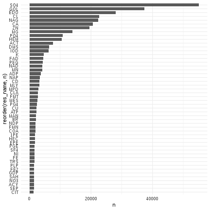
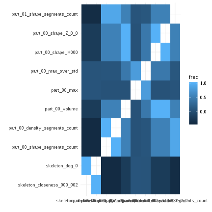
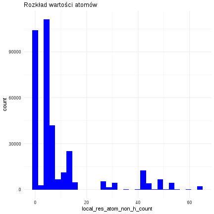
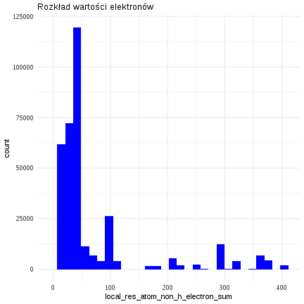

This report was automatically generated with the R package **knitr**
(version 1.20).


```r
---
title: "ZED Raport z analizy danych"
author: "Marcin Burczyk"
output: 
  html_document:
    keep_md: yes
    toc: yes
    fig_height: 8
    fig_width: 10
    df_print: paged
    rows.print: 10
date: '`r format(Sys.Date(), "%d %B %Y")`'
---
```

```
## Error: <text>:15:0: unexpected end of input
## 13: ---
## 14: 
##    ^
```


##Podsumowanie analizy


##Wykorzystane biblioteki


```r
library(dplyr)
library(ggplot2)
library(ggforce)
```

```
## Error in library(ggforce): there is no package called 'ggforce'
```

```r
library(gganimate) #devtools::install_github('thomasp85/gganimate')
library(tidyr)
library(caret)
library(DT)
library(summarytools)
library(gifski)
library(png)
library(data.table)
library(parallel)
library(doMC)
```


##Dane

###Powtarzalność wyników

Aby zapewnić powtarzalność wyników ustawiamy stan losowego generatora liczb.


```r
set.seed(123)
```

###Wczytywanie danych

Dane rozdzielone są znakiem ";", dlatego użyję funkcji read.csv2 do wczytania danych. Kolumna title jest połączeniem kolumn pdb_code, res_name, res_id oraz chain_id, zatem możemy ją usunąć podczas wczytywania, aby uniknąć powtarzania informacji.


```r
all_data <- fread("all_summary.csv", header = TRUE, dec=".", stringsAsFactors = FALSE) %>% select(-(blob_coverage:title))
```

###Przetwarzanie brakujących danych

Wiersze, które w kolumnie "res_name" zawierają niepożądaną przez nas wartość zostają usunięte.


```r
cleaned_data <- all_data %>% filter(!res_name %in% c('UNK', 'UNX', 'UNL', 'DUM', 'N', 'BLOB', 'ALA', 'ARG', 'ASN', 'ASP', 'CYS', 'GLN', 'GLU', 'GLY', 'HIS', 'ILE', 'LEU', 'LYS', 'MET', 'MSE', 'PHE', 'PRO', 'SEC', 'SER', 'THR', 'TRP', 'TYR', 'VAL', 'DA', 'DG', 'DT', 'DC', 'DU', 'A', 'G', 'T', 'C', 'U', 'HOH', 'H20', 'WAT')) 
```

W zbiorze danych występuje kolumna, która równa jest NA we wszystkich wierszach.


```r
rows_without_na_in_weight_co = filter(cleaned_data, !is.na(weight_col))
dim(rows_without_na_in_weight_co)[1]
```

```
## [1] 0
```

Jak widać brak wierszy, których kolumna weight_col nie ma wartości pustej, dlatego możemy ją wykluczyć z dalszej analizy.


```r
cleaned_data_without_empty_col <- select(cleaned_data, -weight_col)

cleaned_data_without_empty_col <- cleaned_data_without_empty_col[complete.cases(cleaned_data_without_empty_col),]
```

###Rozmiar danych oraz ich statystyki

Zebrane dane zawierają… 408 kolumn oraz 525666 wierszy.
Dane są typu character, numeric, integer. Większość kolumn jest numeryczna. Ich podstawowe statystyki prezentują się tak:


```
## ### Descriptive Statistics     
## **Data Frame:** cleaned_data_without_empty_col     
## **N:** 525666   
## 
## |                                          &nbsp; |          Mean |      Std.Dev |           Max |
## |------------------------------------------------:|--------------:|-------------:|--------------:|
## |                        **blob_volume_coverage** |  6.700000e-01 | 2.500000e-01 |  1.000000e+00 |
## |                 **blob_volume_coverage_second** |  2.000000e-02 | 7.000000e-02 |  1.000000e+00 |
## |                         **res_volume_coverage** |  5.200000e-01 | 2.800000e-01 |  1.000000e+00 |
## |                  **res_volume_coverage_second** |  7.000000e-02 | 2.100000e-01 |  1.000000e+00 |
## |                        **local_res_atom_count** |  1.339000e+01 | 1.534000e+01 |  1.780000e+02 |
## |                  **local_res_atom_non_h_count** |  1.311000e+01 | 1.492000e+01 |  1.110000e+02 |
## |          **local_res_atom_non_h_occupancy_sum** |  1.268000e+01 | 1.468000e+01 |  1.110000e+02 |
## |           **local_res_atom_non_h_electron_sum** |  9.830000e+01 | 1.006700e+02 |  1.223000e+03 |
## | **local_res_atom_non_h_electron_occupancy_sum** |  9.434000e+01 | 9.875000e+01 |  8.580000e+02 |
## |                      **local_res_atom_C_count** |  7.310000e+00 | 1.049000e+01 |  8.400000e+01 |
## |                      **local_res_atom_N_count** |  1.180000e+00 | 2.120000e+00 |  2.800000e+01 |
## |                      **local_res_atom_O_count** |  3.790000e+00 | 4.040000e+00 |  5.500000e+01 |
## |                      **local_res_atom_S_count** |  2.300000e-01 | 5.300000e-01 |  1.300000e+01 |
## |                       **dict_atom_non_h_count** |  1.361000e+01 | 1.551000e+01 |  1.280000e+02 |
## |                **dict_atom_non_h_electron_sum** |  1.017700e+02 | 1.042600e+02 |  1.223000e+03 |
## |                           **dict_atom_C_count** |  7.590000e+00 | 1.104000e+01 |  9.300000e+01 |
## |                           **dict_atom_N_count** |  1.190000e+00 | 2.130000e+00 |  2.800000e+01 |
## |                           **dict_atom_O_count** |  3.990000e+00 | 4.160000e+00 |  5.500000e+01 |
## |                           **dict_atom_S_count** |  2.300000e-01 | 5.400000e-01 |  1.300000e+01 |
## |                            **skeleton_cycle_4** |  4.000000e-01 | 9.080000e+00 |  2.792000e+03 |
## |                           **skeleton_diameter** |  2.529000e+01 | 3.120000e+01 |  6.710000e+02 |
## |                            **skeleton_cycle_6** |  1.000000e-02 | 5.400000e-01 |  1.500000e+02 |
## |                            **skeleton_cycle_7** |  0.000000e+00 | 2.600000e-01 |  5.400000e+01 |
## |                  **skeleton_closeness_006_008** |  2.800000e+00 | 1.538000e+01 |  4.170000e+02 |
## |                  **skeleton_closeness_002_004** |  9.000000e-02 | 3.810000e+00 |  9.070000e+02 |
## |                            **skeleton_cycle_3** |  6.000000e-02 | 3.400000e+00 |  9.570000e+02 |
## |                         **skeleton_avg_degree** |  1.580000e+00 | 6.400000e-01 |  6.460000e+00 |
## |                  **skeleton_closeness_004_006** |  1.010000e+00 | 1.068000e+01 |  4.920000e+02 |
## |                  **skeleton_closeness_010_012** |  3.700000e+00 | 1.200000e+01 |  7.790000e+02 |
## |                  **skeleton_closeness_012_014** |  3.430000e+00 | 1.109000e+01 |  2.579000e+03 |
## |                              **skeleton_edges** |  3.733000e+01 | 6.494000e+01 |  9.934000e+03 |
## |                             **skeleton_radius** |  1.294000e+01 | 1.568000e+01 |  3.360000e+02 |
## |                       **skeleton_cycle_8_plus** |  2.000000e-01 | 6.260000e+00 |  1.863000e+03 |
## |                  **skeleton_closeness_020_030** |  5.540000e+00 | 1.212000e+01 |  1.009000e+03 |
## |                         **skeleton_deg_5_plus** |  1.600000e-01 | 9.680000e+00 |  2.998000e+03 |
## |                  **skeleton_closeness_016_018** |  2.340000e+00 | 6.310000e+00 |  4.340000e+02 |
## |                  **skeleton_closeness_008_010** |  3.730000e+00 | 1.441000e+01 |  3.040000e+02 |
## |                  **skeleton_closeness_018_020** |  1.820000e+00 | 4.900000e+00 |  5.690000e+02 |
## |                 **skeleton_average_clustering** |  0.000000e+00 | 0.000000e+00 |  4.700000e-01 |
## |                  **skeleton_closeness_040_050** |  1.910000e+00 | 6.990000e+00 |  5.720000e+02 |
## |                  **skeleton_closeness_014_016** |  2.980000e+00 | 8.830000e+00 |  1.290000e+02 |
## |                             **skeleton_center** |  1.620000e+00 | 2.170000e+00 |  2.510000e+02 |
## |                  **skeleton_closeness_000_002** |  1.100000e-01 | 5.600000e-01 |  2.040000e+02 |
## |                            **skeleton_density** |  2.100000e-01 | 3.000000e-01 |  1.000000e+00 |
## |                  **skeleton_closeness_030_040** |  2.970000e+00 | 7.850000e+00 |  8.640000e+02 |
## |                              **skeleton_deg_4** |  1.300000e-01 | 1.210000e+00 |  2.280000e+02 |
## |                              **skeleton_deg_0** |  1.100000e-01 | 3.100000e-01 |  1.000000e+00 |
## |                              **skeleton_deg_1** |  3.320000e+00 | 3.570000e+00 |  8.500000e+01 |
## |                              **skeleton_deg_2** |  3.177000e+01 | 4.917000e+01 |  8.770000e+02 |
## |                              **skeleton_deg_3** |  2.110000e+00 | 5.120000e+00 |  1.570000e+02 |
## |                **skeleton_graph_clique_number** |  1.900000e+00 | 3.300000e-01 |  5.000000e+00 |
## |                              **skeleton_nodes** |  3.760000e+01 | 5.718000e+01 |  3.801000e+03 |
## |                             **skeleton_cycles** |  7.400000e-01 | 2.039000e+01 |  6.134000e+03 |
## |                            **skeleton_cycle_5** |  6.000000e-02 | 1.210000e+00 |  3.200000e+02 |
## |                 **skeleton_closeness_050_plus** |  5.160000e+00 | 5.920000e+00 |  3.100000e+02 |
## |                          **skeleton_periphery** |  2.010000e+00 | 1.030000e+00 |  1.010000e+02 |
## |                                **local_volume** |  8.990400e+02 | 1.495740e+03 |  9.095251e+04 |
## |                             **local_electrons** |  1.884000e+01 | 2.582000e+01 |  4.424400e+02 |
## |                                  **local_mean** |  2.000000e-02 | 2.000000e-02 |  4.300000e-01 |
## |                                   **local_std** |  1.300000e-01 | 1.000000e-01 |  1.960000e+00 |
## |                                   **local_min** |  0.000000e+00 | 0.000000e+00 |  0.000000e+00 |
## |                                   **local_max** |  1.420000e+00 | 1.620000e+00 |  4.463000e+01 |
## |                          **local_max_over_std** |  1.021000e+01 | 7.690000e+00 |  1.732500e+02 |
## |                              **local_skewness** |  2.300000e-01 | 1.900000e-01 |  4.040000e+00 |
## |               **local_cut_by_mainchain_volume** |  3.900000e-01 | 1.180000e+00 |  5.350000e+01 |
## |                      **local_near_cut_count_C** |  4.620000e+00 | 6.120000e+00 |  1.630000e+02 |
## |                  **local_near_cut_count_other** |  1.000000e-02 | 1.400000e-01 |  1.400000e+01 |
## |                      **local_near_cut_count_S** |  1.300000e-01 | 5.600000e-01 |  1.500000e+01 |
## |                      **local_near_cut_count_O** |  2.210000e+00 | 2.770000e+00 |  7.600000e+01 |
## |                      **local_near_cut_count_N** |  2.300000e+00 | 2.740000e+00 |  4.100000e+01 |
## |                **part_00_shape_segments_count** |  3.573900e+02 | 1.134620e+03 |  1.145770e+05 |
## |              **part_00_density_segments_count** |  3.573900e+02 | 1.134620e+03 |  1.145770e+05 |
## |                              **part_00_volume** |  3.482000e+01 | 5.171000e+01 |  2.427940e+03 |
## |                           **part_00_electrons** |  1.863000e+01 | 2.567000e+01 |  4.411400e+02 |
## |                                **part_00_mean** |  6.200000e-01 | 4.000000e-01 |  8.600000e+00 |
## |                                 **part_00_std** |  2.200000e-01 | 3.100000e-01 |  8.010000e+00 |
## |                                 **part_00_max** |  1.420000e+00 | 1.620000e+00 |  4.463000e+01 |
## |                        **part_00_max_over_std** |  1.021000e+01 | 7.690000e+00 |  1.732500e+02 |
## |                            **part_00_skewness** |  2.300000e-01 | 3.500000e-01 |  1.051000e+01 |
## |                               **part_00_parts** |  1.070000e+00 | 3.800000e-01 |  2.800000e+01 |
## |                            **part_00_shape_O3** |  1.792380e+06 | 1.001133e+07 |  2.628817e+09 |
## |                            **part_00_shape_O4** |  1.168746e+13 | 1.073848e+15 |  4.338385e+17 |
## |                            **part_00_shape_O5** |  1.986078e+20 | 5.157788e+22 |  2.908412e+25 |
## |                            **part_00_shape_FL** |  6.806109e+16 | 1.721076e+19 |  8.380412e+21 |
## |                       **part_00_shape_O3_norm** |  4.900000e-01 | 3.200000e-01 |  3.357000e+01 |
## |                       **part_00_shape_O4_norm** |  6.000000e-02 | 8.000000e-02 |  6.010000e+00 |
## |                       **part_00_shape_O5_norm** |  0.000000e+00 | 0.000000e+00 |  4.100000e-01 |
## |                       **part_00_shape_FL_norm** |  6.000000e-02 | 4.600000e-01 |  1.551400e+02 |
## |                            **part_00_shape_I1** |  3.145250e+09 | 3.122786e+11 |  1.633222e+14 |
## |                            **part_00_shape_I2** |  3.240074e+20 | 8.567148e+22 |  3.583058e+25 |
## |                            **part_00_shape_I3** |  9.435030e+22 | 4.323175e+25 |  2.665214e+28 |
## |                            **part_00_shape_I4** |  3.826632e+16 | 9.204644e+18 |  4.526598e+21 |
## |                            **part_00_shape_I5** |  1.840314e+16 | 4.001724e+18 |  1.957388e+21 |
## |                            **part_00_shape_I6** |  1.806303e+18 | 6.362901e+20 |  3.743294e+23 |
## |                       **part_00_shape_I1_norm** |  5.500000e-01 | 3.460000e+00 |  1.973440e+03 |
## |                       **part_00_shape_I2_norm** |  9.000000e-02 | 1.010000e+00 |  2.563500e+02 |
## |                       **part_00_shape_I3_norm** |  1.192000e+01 | 5.778770e+03 |  3.892018e+06 |
## |                       **part_00_shape_I4_norm** |  4.000000e-02 | 4.400000e-01 |  1.637200e+02 |
## |                       **part_00_shape_I5_norm** |  3.000000e-02 | 4.400000e-01 |  1.809500e+02 |
## |                       **part_00_shape_I6_norm** |  5.400000e-01 | 1.026400e+02 |  6.621913e+04 |
## |                          **part_00_shape_M000** |  4.352120e+03 | 6.464000e+03 |  3.034930e+05 |
## |                            **part_00_shape_CI** |  5.000000e-02 | 4.100000e+00 |  7.004000e+01 |
## |                         **part_00_shape_E3_E1** |  2.500000e-01 | 2.000000e-01 |  9.900000e-01 |
## |                         **part_00_shape_E2_E1** |  4.300000e-01 | 2.400000e-01 |  1.000000e+00 |
## |                         **part_00_shape_E3_E2** |  5.600000e-01 | 2.300000e-01 |  1.000000e+00 |
## |                       **part_00_shape_sqrt_E1** |  8.250000e+00 | 6.000000e+00 |  2.027600e+02 |
## |                       **part_00_shape_sqrt_E2** |  4.570000e+00 | 2.740000e+00 |  3.452000e+01 |
## |                       **part_00_shape_sqrt_E3** |  3.040000e+00 | 1.410000e+00 |  2.034000e+01 |
## |                          **part_00_density_O3** |  8.482038e+05 | 3.055757e+06 |  5.673726e+08 |
## |                          **part_00_density_O4** |  1.465464e+12 | 4.157537e+13 |  2.005882e+16 |
## |                          **part_00_density_O5** |  1.898635e+18 | 2.847287e+20 |  1.807559e+23 |
## |                          **part_00_density_FL** |  4.049750e+15 | 8.062130e+17 |  4.048899e+20 |
## |                     **part_00_density_O3_norm** |  7.300000e-01 | 6.400000e-01 |  1.867800e+02 |
## |                     **part_00_density_O4_norm** |  1.400000e-01 | 2.000000e-01 |  1.304000e+01 |
## |                     **part_00_density_O5_norm** |  1.000000e-02 | 2.000000e-02 |  4.430000e+00 |
## |                     **part_00_density_FL_norm** |  2.700000e-01 | 2.940000e+00 |  1.301480e+03 |
## |                          **part_00_density_I1** |  1.118580e+09 | 3.508785e+10 |  1.282083e+13 |
## |                          **part_00_density_I2** |  1.504415e+19 | 3.474015e+21 |  1.508585e+24 |
## |                          **part_00_density_I3** |  1.091479e+21 | 3.353102e+23 |  1.642551e+26 |
## |                          **part_00_density_I4** |  2.427965e+15 | 4.550595e+17 |  2.341520e+20 |
## |                          **part_00_density_I5** |  1.346775e+15 | 2.227923e+17 |  1.203267e+20 |
## |                          **part_00_density_I6** |  4.439976e+16 | 1.004454e+19 |  5.254845e+21 |
## |                     **part_00_density_I1_norm** |  1.590000e+00 | 1.034900e+02 |  6.117316e+04 |
## |                     **part_00_density_I2_norm** |  7.000000e-01 | 1.730000e+01 |  7.616410e+03 |
## |                     **part_00_density_I3_norm** |  1.070213e+04 | 5.524743e+06 |  3.740081e+09 |
## |                     **part_00_density_I4_norm** |  2.100000e-01 | 2.730000e+00 |  1.301020e+03 |
## |                     **part_00_density_I5_norm** |  1.600000e-01 | 2.640000e+00 |  1.300720e+03 |
## |                     **part_00_density_I6_norm** |  3.823000e+01 | 1.768438e+04 |  1.142138e+07 |
## |                        **part_00_density_M000** |  2.328360e+03 | 3.209330e+03 |  5.514218e+04 |
## |                          **part_00_density_CI** |  5.000000e-02 | 4.700000e+00 |  8.996000e+01 |
## |                       **part_00_density_E3_E1** |  2.500000e-01 | 2.100000e-01 |  1.000000e+00 |
## |                       **part_00_density_E2_E1** |  4.300000e-01 | 2.500000e-01 |  1.000000e+00 |
## |                       **part_00_density_E3_E2** |  5.600000e-01 | 2.400000e-01 |  1.000000e+00 |
## |                     **part_00_density_sqrt_E1** |  7.910000e+00 | 5.890000e+00 |  2.024800e+02 |
## |                     **part_00_density_sqrt_E2** |  4.330000e+00 | 2.650000e+00 |  3.298000e+01 |
## |                     **part_00_density_sqrt_E3** |  2.860000e+00 | 1.330000e+00 |  1.938000e+01 |
## |                         **part_00_shape_Z_7_3** |  4.253000e+01 | 3.685000e+01 |  5.587100e+02 |
## |                         **part_00_shape_Z_0_0** |  2.720000e+01 | 1.730000e+01 |  2.691700e+02 |
## |                         **part_00_shape_Z_7_0** |  1.793000e+01 | 1.697000e+01 |  3.669900e+02 |
## |                         **part_00_shape_Z_7_1** |  2.922000e+01 | 2.622000e+01 |  4.461400e+02 |
## |                         **part_00_shape_Z_3_0** |  1.561000e+01 | 1.312000e+01 |  2.081300e+02 |
## |                         **part_00_shape_Z_5_2** |  3.631000e+01 | 2.931000e+01 |  4.551000e+02 |
## |                         **part_00_shape_Z_6_1** |  3.287000e+01 | 2.888000e+01 |  4.762100e+02 |
## |                         **part_00_shape_Z_3_1** |  2.533000e+01 | 1.914000e+01 |  2.972800e+02 |
## |                         **part_00_shape_Z_6_0** |  1.536000e+01 | 1.423000e+01 |  2.990100e+02 |
## |                         **part_00_shape_Z_2_1** |  3.971000e+01 | 2.795000e+01 |  4.208100e+02 |
## |                         **part_00_shape_Z_6_3** |  4.823000e+01 | 4.115000e+01 |  6.084300e+02 |
## |                         **part_00_shape_Z_2_0** |  2.921000e+01 | 1.999000e+01 |  3.265300e+02 |
## |                         **part_00_shape_Z_6_2** |  4.357000e+01 | 3.777000e+01 |  5.622000e+02 |
## |                         **part_00_shape_Z_5_0** |  1.894000e+01 | 1.736000e+01 |  3.155700e+02 |
## |                         **part_00_shape_Z_5_1** |  3.004000e+01 | 2.478000e+01 |  4.074900e+02 |
## |                         **part_00_shape_Z_4_2** |  4.538000e+01 | 3.613000e+01 |  5.344700e+02 |
## |                         **part_00_shape_Z_1_0** |  1.420000e+00 | 2.100000e-01 |  2.290000e+00 |
## |                         **part_00_shape_Z_4_1** |  3.906000e+01 | 3.161000e+01 |  4.656000e+02 |
## |                         **part_00_shape_Z_7_2** |  3.782000e+01 | 3.342000e+01 |  5.303200e+02 |
## |                         **part_00_shape_Z_4_0** |  2.127000e+01 | 1.776000e+01 |  3.130900e+02 |
## |                       **part_00_density_Z_7_3** |  3.160000e+01 | 2.784000e+01 |  2.111200e+02 |
## |                       **part_00_density_Z_0_0** |  1.996000e+01 | 1.255000e+01 |  1.147400e+02 |
## |                       **part_00_density_Z_7_0** |  1.542000e+01 | 1.398000e+01 |  1.269200e+02 |
## |                       **part_00_density_Z_7_1** |  2.325000e+01 | 2.067000e+01 |  1.599200e+02 |
## |                       **part_00_density_Z_3_0** |  1.176000e+01 | 9.820000e+00 |  8.854000e+01 |
## |                       **part_00_density_Z_5_2** |  2.665000e+01 | 2.175000e+01 |  1.821800e+02 |
## |                       **part_00_density_Z_6_1** |  2.585000e+01 | 2.279000e+01 |  1.960700e+02 |
## |                       **part_00_density_Z_3_1** |  1.804000e+01 | 1.395000e+01 |  1.208600e+02 |
## |                       **part_00_density_Z_6_0** |  1.316000e+01 | 1.274000e+01 |  1.224900e+02 |
## |                       **part_00_density_Z_2_1** |  2.932000e+01 | 2.003000e+01 |  1.763800e+02 |
## |                       **part_00_density_Z_6_3** |  3.576000e+01 | 3.101000e+01 |  2.828000e+02 |
## |                       **part_00_density_Z_2_0** |  2.263000e+01 | 1.480000e+01 |  1.352800e+02 |
## |                       **part_00_density_Z_6_2** |  3.293000e+01 | 2.877000e+01 |  2.638900e+02 |
## |                       **part_00_density_Z_5_0** |  1.551000e+01 | 1.362000e+01 |  1.182300e+02 |
## |                       **part_00_density_Z_5_1** |  2.283000e+01 | 1.872000e+01 |  1.670800e+02 |
## |                       **part_00_density_Z_4_2** |  3.372000e+01 | 2.632000e+01 |  2.366700e+02 |
## |                       **part_00_density_Z_1_0** |  1.410000e+00 | 2.100000e-01 |  2.290000e+00 |
## |                       **part_00_density_Z_4_1** |  2.984000e+01 | 2.324000e+01 |  2.045100e+02 |
## |                       **part_00_density_Z_7_2** |  2.879000e+01 | 2.556000e+01 |  1.951200e+02 |
## |                       **part_00_density_Z_4_0** |  1.787000e+01 | 1.411000e+01 |  1.225800e+02 |
## |                **part_01_shape_segments_count** |  2.990900e+02 | 9.906900e+02 |  6.920200e+04 |
## |              **part_01_density_segments_count** |  2.990900e+02 | 9.906900e+02 |  6.920200e+04 |
## |                              **part_01_volume** |  2.695000e+01 | 4.216000e+01 |  1.996250e+03 |
## |                           **part_01_electrons** |  1.609000e+01 | 2.339000e+01 |  3.957000e+02 |
## |                                **part_01_mean** |  6.800000e-01 | 4.300000e-01 |  8.860000e+00 |
## |                                 **part_01_std** |  2.100000e-01 | 3.100000e-01 |  8.080000e+00 |
## |                                 **part_01_max** |  1.420000e+00 | 1.620000e+00 |  4.463000e+01 |
## |                        **part_01_max_over_std** |  1.021000e+01 | 7.690000e+00 |  1.732500e+02 |
## |                            **part_01_skewness** |  2.200000e-01 | 3.500000e-01 |  1.077000e+01 |
## |                               **part_01_parts** |  1.290000e+00 | 7.100000e-01 |  2.400000e+01 |
## |                            **part_01_shape_O3** |  1.343518e+06 | 7.744394e+06 |  2.085834e+09 |
## |                            **part_01_shape_O4** |  6.380835e+12 | 5.614323e+14 |  2.632982e+17 |
## |                            **part_01_shape_O5** |  6.863732e+19 | 1.657961e+22 |  8.480462e+24 |
## |                            **part_01_shape_FL** |  3.759482e+16 | 9.759900e+18 |  5.267348e+21 |
## |                       **part_01_shape_O3_norm** |  5.300000e-01 | 4.000000e-01 |  3.843000e+01 |
## |                       **part_01_shape_O4_norm** |  7.000000e-02 | 1.100000e-01 |  1.175000e+01 |
## |                       **part_01_shape_O5_norm** |  0.000000e+00 | 1.000000e-02 |  1.230000e+00 |
## |                       **part_01_shape_FL_norm** |  1.300000e-01 | 1.700000e+00 |  5.526100e+02 |
## |                            **part_01_shape_I1** |  2.367876e+09 | 2.486583e+11 |  1.307399e+14 |
## |                            **part_01_shape_I2** |  1.699563e+20 | 4.500067e+22 |  1.923967e+25 |
## |                            **part_01_shape_I3** |  6.008757e+22 | 2.779798e+25 |  1.708172e+28 |
## |                            **part_01_shape_I4** |  2.146470e+16 | 5.343137e+18 |  2.998393e+21 |
## |                            **part_01_shape_I5** |  1.071129e+16 | 2.461186e+18 |  1.485756e+21 |
## |                            **part_01_shape_I6** |  1.131738e+18 | 4.072149e+20 |  2.400810e+23 |
## |                       **part_01_shape_I1_norm** |  7.300000e-01 | 5.020000e+00 |  2.592420e+03 |
## |                       **part_01_shape_I2_norm** |  2.100000e-01 | 4.710000e+00 |  1.639310e+03 |
## |                       **part_01_shape_I3_norm** |  2.500000e+01 | 1.049436e+04 |  6.717223e+06 |
## |                       **part_01_shape_I4_norm** |  1.000000e-01 | 1.690000e+00 |  6.056100e+02 |
## |                       **part_01_shape_I5_norm** |  8.000000e-02 | 1.720000e+00 |  6.409500e+02 |
## |                       **part_01_shape_I6_norm** |  9.700000e-01 | 1.656000e+02 |  9.960460e+04 |
## |                          **part_01_shape_M000** |  3.368540e+03 | 5.270370e+03 |  2.495310e+05 |
## |                            **part_01_shape_CI** |  4.000000e-02 | 4.570000e+00 |  9.132000e+01 |
## |                         **part_01_shape_E3_E1** |  2.600000e-01 | 2.100000e-01 |  9.900000e-01 |
## |                         **part_01_shape_E2_E1** |  4.300000e-01 | 2.500000e-01 |  1.000000e+00 |
## |                         **part_01_shape_E3_E2** |  5.600000e-01 | 2.400000e-01 |  1.000000e+00 |
## |                       **part_01_shape_sqrt_E1** |  7.700000e+00 | 6.020000e+00 |  2.023700e+02 |
## |                       **part_01_shape_sqrt_E2** |  4.180000e+00 | 2.730000e+00 |  3.287000e+01 |
## |                       **part_01_shape_sqrt_E3** |  2.760000e+00 | 1.390000e+00 |  1.936000e+01 |
## |                          **part_01_density_O3** |  7.105127e+05 | 2.655935e+06 |  4.912020e+08 |
## |                          **part_01_density_O4** |  1.071000e+12 | 2.997202e+13 |  1.459115e+16 |
## |                          **part_01_density_O5** |  1.138260e+18 | 1.716813e+20 |  1.102507e+23 |
## |                          **part_01_density_FL** |  2.951413e+15 | 5.910816e+17 |  2.970710e+20 |
## |                     **part_01_density_O3_norm** |  7.500000e-01 | 7.700000e-01 |  2.057400e+02 |
## |                     **part_01_density_O4_norm** |  1.500000e-01 | 2.700000e-01 |  2.842000e+01 |
## |                     **part_01_density_O5_norm** |  1.000000e-02 | 3.000000e-02 |  3.740000e+00 |
## |                     **part_01_density_FL_norm** |  5.900000e-01 | 1.137000e+01 |  4.725470e+03 |
## |                          **part_01_density_I1** |  9.329664e+08 | 2.991852e+10 |  1.098793e+13 |
## |                          **part_01_density_I2** |  1.048692e+19 | 2.442372e+21 |  9.956763e+23 |
## |                          **part_01_density_I3** |  7.984162e+20 | 2.445424e+23 |  1.206633e+26 |
## |                          **part_01_density_I4** |  1.819510e+15 | 3.454708e+17 |  1.786501e+20 |
## |                          **part_01_density_I5** |  1.064908e+15 | 1.832197e+17 |  9.970288e+19 |
## |                          **part_01_density_I6** |  3.289488e+16 | 7.409643e+18 |  3.827444e+21 |
## |                     **part_01_density_I1_norm** |  1.990000e+00 | 1.391300e+02 |  7.434489e+04 |
## |                     **part_01_density_I2_norm** |  1.650000e+00 | 9.833000e+01 |  4.906154e+04 |
## |                     **part_01_density_I3_norm** |  1.934526e+04 | 8.879390e+06 |  5.524616e+09 |
## |                     **part_01_density_I4_norm** |  5.200000e-01 | 1.179000e+01 |  4.724680e+03 |
## |                     **part_01_density_I5_norm** |  4.700000e-01 | 1.222000e+01 |  4.724160e+03 |
## |                     **part_01_density_I6_norm** |  6.171000e+01 | 2.616441e+04 |  1.529053e+07 |
## |                        **part_01_density_M000** |  2.011330e+03 | 2.924370e+03 |  4.946192e+04 |
## |                          **part_01_density_CI** |  4.000000e-02 | 5.160000e+00 |  1.263400e+02 |
## |                       **part_01_density_E3_E1** |  2.600000e-01 | 2.200000e-01 |  1.000000e+00 |
## |                       **part_01_density_E2_E1** |  4.300000e-01 | 2.600000e-01 |  1.000000e+00 |
## |                       **part_01_density_E3_E2** |  5.700000e-01 | 2.400000e-01 |  1.000000e+00 |
## |                     **part_01_density_sqrt_E1** |  7.410000e+00 | 5.900000e+00 |  2.021700e+02 |
## |                     **part_01_density_sqrt_E2** |  3.990000e+00 | 2.640000e+00 |  3.314000e+01 |
## |                     **part_01_density_sqrt_E3** |  2.630000e+00 | 1.320000e+00 |  1.869000e+01 |
## |                         **part_01_shape_Z_7_3** |  3.712000e+01 | 3.417000e+01 |  4.702800e+02 |
## |                         **part_01_shape_Z_0_0** |  2.344000e+01 | 1.596000e+01 |  2.440700e+02 |
## |                         **part_01_shape_Z_7_0** |  1.637000e+01 | 1.573000e+01 |  2.915600e+02 |
## |                         **part_01_shape_Z_7_1** |  2.578000e+01 | 2.434000e+01 |  3.709900e+02 |
## |                         **part_01_shape_Z_3_0** |  1.388000e+01 | 1.234000e+01 |  1.917600e+02 |
## |                         **part_01_shape_Z_5_2** |  3.143000e+01 | 2.722000e+01 |  4.033000e+02 |
## |                         **part_01_shape_Z_6_1** |  2.850000e+01 | 2.696000e+01 |  3.717000e+02 |
## |                         **part_01_shape_Z_3_1** |  2.213000e+01 | 1.786000e+01 |  2.606700e+02 |
## |                         **part_01_shape_Z_6_0** |  1.365000e+01 | 1.364000e+01 |  2.636200e+02 |
## |                         **part_01_shape_Z_2_1** |  3.408000e+01 | 2.581000e+01 |  3.463800e+02 |
## |                         **part_01_shape_Z_6_3** |  4.179000e+01 | 3.825000e+01 |  5.371800e+02 |
## |                         **part_01_shape_Z_2_0** |  2.488000e+01 | 1.855000e+01 |  2.893700e+02 |
## |                         **part_01_shape_Z_6_2** |  3.758000e+01 | 3.505000e+01 |  4.949400e+02 |
## |                         **part_01_shape_Z_5_0** |  1.690000e+01 | 1.617000e+01 |  2.952300e+02 |
## |                         **part_01_shape_Z_5_1** |  2.589000e+01 | 2.295000e+01 |  3.681300e+02 |
## |                         **part_01_shape_Z_4_2** |  3.892000e+01 | 3.347000e+01 |  4.505000e+02 |
## |                         **part_01_shape_Z_1_0** |  1.510000e+00 | 2.700000e-01 |  3.430000e+00 |
## |                         **part_01_shape_Z_4_1** |  3.325000e+01 | 2.927000e+01 |  3.814800e+02 |
## |                         **part_01_shape_Z_7_2** |  3.288000e+01 | 3.088000e+01 |  4.472700e+02 |
## |                         **part_01_shape_Z_4_0** |  1.817000e+01 | 1.672000e+01 |  2.751700e+02 |
## |                       **part_01_density_Z_7_3** |  2.904000e+01 | 2.698000e+01 |  2.030500e+02 |
## |                       **part_01_density_Z_0_0** |  1.813000e+01 | 1.231000e+01 |  1.086700e+02 |
## |                       **part_01_density_Z_7_0** |  1.460000e+01 | 1.346000e+01 |  1.251700e+02 |
## |                       **part_01_density_Z_7_1** |  2.146000e+01 | 1.999000e+01 |  1.556800e+02 |
## |                       **part_01_density_Z_3_0** |  1.103000e+01 | 9.640000e+00 |  8.632000e+01 |
## |                       **part_01_density_Z_5_2** |  2.435000e+01 | 2.119000e+01 |  1.804900e+02 |
## |                       **part_01_density_Z_6_1** |  2.314000e+01 | 2.227000e+01 |  1.910900e+02 |
## |                       **part_01_density_Z_3_1** |  1.670000e+01 | 1.366000e+01 |  1.174500e+02 |
## |                       **part_01_density_Z_6_0** |  1.191000e+01 | 1.260000e+01 |  1.174500e+02 |
## |                       **part_01_density_Z_2_1** |  2.649000e+01 | 1.958000e+01 |  1.709200e+02 |
## |                       **part_01_density_Z_6_3** |  3.232000e+01 | 3.021000e+01 |  2.703100e+02 |
## |                       **part_01_density_Z_2_0** |  2.028000e+01 | 1.459000e+01 |  1.281300e+02 |
## |                       **part_01_density_Z_6_2** |  2.954000e+01 | 2.799000e+01 |  2.535000e+02 |
## |                       **part_01_density_Z_5_0** |  1.444000e+01 | 1.323000e+01 |  1.146300e+02 |
## |                       **part_01_density_Z_5_1** |  2.075000e+01 | 1.819000e+01 |  1.648700e+02 |
## |                       **part_01_density_Z_4_2** |  3.024000e+01 | 2.575000e+01 |  2.247500e+02 |
## |                       **part_01_density_Z_1_0** |  1.500000e+00 | 2.700000e-01 |  3.420000e+00 |
## |                       **part_01_density_Z_4_1** |  2.650000e+01 | 2.278000e+01 |  1.961600e+02 |
## |                       **part_01_density_Z_7_2** |  2.632000e+01 | 2.469000e+01 |  1.917000e+02 |
## |                       **part_01_density_Z_4_0** |  1.573000e+01 | 1.408000e+01 |  1.204600e+02 |
## |                **part_02_shape_segments_count** |  2.508300e+02 | 8.699800e+02 |  4.556400e+04 |
## |              **part_02_density_segments_count** |  2.508300e+02 | 8.699800e+02 |  4.556400e+04 |
## |                              **part_02_volume** |  2.085000e+01 | 3.474000e+01 |  1.632540e+03 |
## |                           **part_02_electrons** |  1.377000e+01 | 2.116000e+01 |  3.511900e+02 |
## |                                **part_02_mean** |  7.300000e-01 | 4.600000e-01 |  9.760000e+00 |
## |                                 **part_02_std** |  2.000000e-01 | 3.200000e-01 |  8.260000e+00 |
## |                                 **part_02_max** |  1.420000e+00 | 1.620000e+00 |  4.463000e+01 |
## |                        **part_02_max_over_std** |  1.021000e+01 | 7.690000e+00 |  1.732500e+02 |
## |                            **part_02_skewness** |  2.000000e-01 | 3.500000e-01 |  1.089000e+01 |
## |                               **part_02_parts** |  1.390000e+00 | 9.000000e-01 |  2.800000e+01 |
## |                            **part_02_shape_O3** |  1.007753e+06 | 6.057379e+06 |  1.668045e+09 |
## |                            **part_02_shape_O4** |  3.643158e+12 | 3.200081e+14 |  1.649676e+17 |
## |                            **part_02_shape_O5** |  2.704061e+19 | 6.960650e+21 |  4.147785e+24 |
## |                            **part_02_shape_FL** |  2.110632e+16 | 5.753105e+18 |  3.330358e+21 |
## |                       **part_02_shape_O3_norm** |  5.700000e-01 | 5.500000e-01 |  6.888000e+01 |
## |                       **part_02_shape_O4_norm** |  9.000000e-02 | 1.700000e-01 |  2.169000e+01 |
## |                       **part_02_shape_O5_norm** |  0.000000e+00 | 2.000000e-02 |  6.420000e+00 |
## |                       **part_02_shape_FL_norm** |  3.500000e-01 | 9.280000e+00 |  3.374840e+03 |
## |                            **part_02_shape_I1** |  1.776034e+09 | 1.943853e+11 |  1.057686e+14 |
## |                            **part_02_shape_I2** |  9.365791e+19 | 2.523605e+22 |  1.085535e+25 |
## |                            **part_02_shape_I3** |  3.680927e+22 | 1.744411e+25 |  1.118111e+28 |
## |                            **part_02_shape_I4** |  1.237077e+16 | 3.289455e+18 |  1.981339e+21 |
## |                            **part_02_shape_I5** |  6.547068e+15 | 1.683199e+18 |  1.081993e+21 |
## |                            **part_02_shape_I6** |  6.930194e+17 | 2.554004e+20 |  1.572613e+23 |
## |                       **part_02_shape_I1_norm** |  1.030000e+00 | 1.356000e+01 |  8.356550e+03 |
## |                       **part_02_shape_I2_norm** |  8.100000e-01 | 9.695000e+01 |  4.807317e+04 |
## |                       **part_02_shape_I3_norm** |  1.832800e+02 | 9.851794e+04 |  6.981922e+07 |
## |                       **part_02_shape_I4_norm** |  3.200000e-01 | 9.480000e+00 |  3.367000e+03 |
## |                       **part_02_shape_I5_norm** |  2.900000e-01 | 9.670000e+00 |  3.361780e+03 |
## |                       **part_02_shape_I6_norm** |  3.030000e+00 | 8.369500e+02 |  5.755581e+05 |
## |                          **part_02_shape_M000** |  2.606340e+03 | 4.343070e+03 |  2.040670e+05 |
## |                            **part_02_shape_CI** |  3.000000e-02 | 4.850000e+00 |  1.470400e+02 |
## |                         **part_02_shape_E3_E1** |  2.700000e-01 | 2.200000e-01 |  1.000000e+00 |
## |                         **part_02_shape_E2_E1** |  4.400000e-01 | 2.600000e-01 |  1.000000e+00 |
## |                         **part_02_shape_E3_E2** |  5.800000e-01 | 2.400000e-01 |  1.000000e+00 |
## |                       **part_02_shape_sqrt_E1** |  7.050000e+00 | 6.080000e+00 |  2.018100e+02 |
## |                       **part_02_shape_sqrt_E2** |  3.770000e+00 | 2.730000e+00 |  3.331000e+01 |
## |                       **part_02_shape_sqrt_E3** |  2.490000e+00 | 1.390000e+00 |  1.854000e+01 |
## |                          **part_02_density_O3** |  5.870499e+05 | 2.285433e+06 |  4.228737e+08 |
## |                          **part_02_density_O4** |  7.689604e+11 | 2.157225e+13 |  1.060965e+16 |
## |                          **part_02_density_O5** |  6.834675e+17 | 1.044173e+20 |  6.745876e+22 |
## |                          **part_02_density_FL** |  2.115601e+15 | 4.259145e+17 |  2.126359e+20 |
## |                     **part_02_density_O3_norm** |  7.700000e-01 | 1.070000e+00 |  3.829800e+02 |
## |                     **part_02_density_O4_norm** |  1.600000e-01 | 4.300000e-01 |  1.155500e+02 |
## |                     **part_02_density_O5_norm** |  1.000000e-02 | 1.600000e-01 |  1.130500e+02 |
## |                     **part_02_density_FL_norm** |  2.320000e+00 | 3.068500e+02 |  1.979128e+05 |
## |                          **part_02_density_I1** |  7.664049e+08 | 2.506881e+10 |  9.365256e+12 |
## |                          **part_02_density_I2** |  7.297344e+18 | 1.725455e+21 |  6.907748e+23 |
## |                          **part_02_density_I3** |  5.624374e+20 | 1.726537e+23 |  8.766542e+25 |
## |                          **part_02_density_I4** |  1.345528e+15 | 2.577937e+17 |  1.314425e+20 |
## |                          **part_02_density_I5** |  8.321466e+14 | 1.466974e+17 |  7.731350e+19 |
## |                          **part_02_density_I6** |  2.377621e+16 | 5.359422e+18 |  2.750679e+21 |
## |                     **part_02_density_I1_norm** |  2.990000e+00 | 3.899300e+02 |  2.583039e+05 |
## |                     **part_02_density_I2_norm** |  1.158000e+01 | 3.176840e+03 |  2.154056e+06 |
## |                     **part_02_density_I3_norm** |  1.520043e+05 | 9.312596e+07 |  6.670879e+10 |
## |                     **part_02_density_I4_norm** |  2.390000e+00 | 3.922900e+02 |  2.648333e+05 |
## |                     **part_02_density_I5_norm** |  2.440000e+00 | 4.508300e+02 |  3.094470e+05 |
## |                     **part_02_density_I6_norm** |  2.593000e+02 | 1.409394e+05 |  9.891203e+07 |
## |                        **part_02_density_M000** |  1.721580e+03 | 2.644540e+03 |  4.389833e+04 |
## |                          **part_02_density_CI** |  3.000000e-02 | 5.420000e+00 |  1.675400e+02 |
## |                       **part_02_density_E3_E1** |  2.700000e-01 | 2.200000e-01 |  1.000000e+00 |
## |                       **part_02_density_E2_E1** |  4.400000e-01 | 2.600000e-01 |  1.000000e+00 |
## |                       **part_02_density_E3_E2** |  5.800000e-01 | 2.400000e-01 |  1.000000e+00 |
## |                     **part_02_density_sqrt_E1** |  6.810000e+00 | 5.950000e+00 |  2.017100e+02 |
## |                     **part_02_density_sqrt_E2** |  3.610000e+00 | 2.640000e+00 |  3.235000e+01 |
## |                     **part_02_density_sqrt_E3** |  2.380000e+00 | 1.320000e+00 |  1.784000e+01 |
## |                         **part_02_shape_Z_7_3** |  3.237000e+01 | 3.149000e+01 |  4.165700e+02 |
## |                         **part_02_shape_Z_0_0** |  2.000000e+01 | 1.490000e+01 |  2.207200e+02 |
## |                         **part_02_shape_Z_7_0** |  1.509000e+01 | 1.441000e+01 |  2.288400e+02 |
## |                         **part_02_shape_Z_7_1** |  2.287000e+01 | 2.237000e+01 |  3.197400e+02 |
## |                         **part_02_shape_Z_3_0** |  1.231000e+01 | 1.151000e+01 |  1.951600e+02 |
## |                         **part_02_shape_Z_5_2** |  2.712000e+01 | 2.517000e+01 |  3.447900e+02 |
## |                         **part_02_shape_Z_6_1** |  2.423000e+01 | 2.518000e+01 |  3.405200e+02 |
## |                         **part_02_shape_Z_3_1** |  1.920000e+01 | 1.665000e+01 |  2.619600e+02 |
## |                         **part_02_shape_Z_6_0** |  1.181000e+01 | 1.301000e+01 |  2.046900e+02 |
## |                         **part_02_shape_Z_2_1** |  2.886000e+01 | 2.403000e+01 |  3.159100e+02 |
## |                         **part_02_shape_Z_6_3** |  3.563000e+01 | 3.558000e+01 |  4.954200e+02 |
## |                         **part_02_shape_Z_2_0** |  2.090000e+01 | 1.736000e+01 |  2.647700e+02 |
## |                         **part_02_shape_Z_6_2** |  3.186000e+01 | 3.255000e+01 |  4.610900e+02 |
## |                         **part_02_shape_Z_5_0** |  1.514000e+01 | 1.490000e+01 |  2.418300e+02 |
## |                         **part_02_shape_Z_5_1** |  2.236000e+01 | 2.111000e+01 |  3.003900e+02 |
## |                         **part_02_shape_Z_4_2** |  3.286000e+01 | 3.113000e+01 |  4.121900e+02 |
## |                         **part_02_shape_Z_1_0** |  1.660000e+00 | 4.100000e-01 |  5.050000e+00 |
## |                         **part_02_shape_Z_4_1** |  2.785000e+01 | 2.719000e+01 |  3.552000e+02 |
## |                         **part_02_shape_Z_7_2** |  2.865000e+01 | 2.832000e+01 |  3.823000e+02 |
## |                         **part_02_shape_Z_4_0** |  1.528000e+01 | 1.571000e+01 |  2.477400e+02 |
## |                       **part_02_density_Z_7_3** |  2.666000e+01 | 2.583000e+01 |  2.001800e+02 |
## |                       **part_02_density_Z_0_0** |  1.626000e+01 | 1.210000e+01 |  1.023700e+02 |
## |                       **part_02_density_Z_7_0** |  1.401000e+01 | 1.282000e+01 |  1.229800e+02 |
## |                       **part_02_density_Z_7_1** |  1.995000e+01 | 1.908000e+01 |  1.516200e+02 |
## |                       **part_02_density_Z_3_0** |  1.034000e+01 | 9.330000e+00 |  8.338000e+01 |
## |                       **part_02_density_Z_5_2** |  2.218000e+01 | 2.039000e+01 |  1.784800e+02 |
## |                       **part_02_density_Z_6_1** |  2.040000e+01 | 2.168000e+01 |  1.858100e+02 |
## |                       **part_02_density_Z_3_1** |  1.534000e+01 | 1.324000e+01 |  1.138300e+02 |
## |                       **part_02_density_Z_6_0** |  1.062000e+01 | 1.244000e+01 |  1.151500e+02 |
## |                       **part_02_density_Z_2_1** |  2.358000e+01 | 1.916000e+01 |  1.652800e+02 |
## |                       **part_02_density_Z_6_3** |  2.874000e+01 | 2.930000e+01 |  2.570900e+02 |
## |                       **part_02_density_Z_2_0** |  1.791000e+01 | 1.441000e+01 |  1.205600e+02 |
## |                       **part_02_density_Z_6_2** |  2.608000e+01 | 2.710000e+01 |  2.425500e+02 |
## |                       **part_02_density_Z_5_0** |  1.353000e+01 | 1.268000e+01 |  1.113200e+02 |
## |                       **part_02_density_Z_5_1** |  1.889000e+01 | 1.742000e+01 |  1.624200e+02 |
## |                       **part_02_density_Z_4_2** |  2.667000e+01 | 2.512000e+01 |  2.142100e+02 |
## |                       **part_02_density_Z_1_0** |  1.650000e+00 | 4.100000e-01 |  5.050000e+00 |
## |                       **part_02_density_Z_4_1** |  2.314000e+01 | 2.224000e+01 |  1.875600e+02 |
## |                       **part_02_density_Z_7_2** |  2.412000e+01 | 2.353000e+01 |  1.884000e+02 |
## |                       **part_02_density_Z_4_0** |  1.367000e+01 | 1.394000e+01 |  1.193400e+02 |
## |                                  **grid_space** |  2.000000e-01 | 0.000000e+00 |  2.000000e-01 |
## |                              **solvent_radius** |  1.900000e+00 | 0.000000e+00 |  1.900000e+00 |
## |                      **solvent_opening_radius** |  1.400000e+00 | 0.000000e+00 |  1.400000e+00 |
## |                        **resolution_max_limit** |  1.000000e+00 | 0.000000e+00 |  1.000000e+00 |
## |                                  **resolution** |  2.130000e+00 | 5.200000e-01 |  9.000000e+00 |
## |                                   **FoFc_mean** |  0.000000e+00 | 0.000000e+00 |  0.000000e+00 |
## |                                    **FoFc_std** |  1.300000e-01 | 5.000000e-02 |  8.500000e-01 |
## |                             **FoFc_square_std** |  2.000000e-02 | 2.000000e-02 |  7.200000e-01 |
## |                                    **FoFc_min** | -7.100000e-01 | 3.000000e-01 | -4.000000e-02 |
## |                                    **FoFc_max** |  2.680000e+00 | 2.560000e+00 |  4.526000e+01 |
## |                      **part_step_FoFc_std_min** |  2.800000e+00 | 0.000000e+00 |  2.800000e+00 |
## |                      **part_step_FoFc_std_max** |  4.050000e+00 | 0.000000e+00 |  4.050000e+00 |
## |                     **part_step_FoFc_std_step** |  5.000000e-01 | 0.000000e+00 |  5.000000e-01 |
## 
## Table: Table continues below
## 
##  
## 
## |                                          &nbsp; |         Min | Pct.Valid |
## |------------------------------------------------:|------------:|----------:|
## |                        **blob_volume_coverage** |        0.02 |    100.00 |
## |                 **blob_volume_coverage_second** |        0.00 |    100.00 |
## |                         **res_volume_coverage** |        0.00 |    100.00 |
## |                  **res_volume_coverage_second** |        0.00 |    100.00 |
## |                        **local_res_atom_count** |        1.00 |    100.00 |
## |                  **local_res_atom_non_h_count** |        1.00 |    100.00 |
## |          **local_res_atom_non_h_occupancy_sum** |       -7.38 |    100.00 |
## |           **local_res_atom_non_h_electron_sum** |        3.00 |    100.00 |
## | **local_res_atom_non_h_electron_occupancy_sum** |      -45.91 |    100.00 |
## |                      **local_res_atom_C_count** |        0.00 |    100.00 |
## |                      **local_res_atom_N_count** |        0.00 |    100.00 |
## |                      **local_res_atom_O_count** |        0.00 |    100.00 |
## |                      **local_res_atom_S_count** |        0.00 |    100.00 |
## |                       **dict_atom_non_h_count** |        1.00 |    100.00 |
## |                **dict_atom_non_h_electron_sum** |        3.00 |    100.00 |
## |                           **dict_atom_C_count** |        0.00 |    100.00 |
## |                           **dict_atom_N_count** |        0.00 |    100.00 |
## |                           **dict_atom_O_count** |        0.00 |    100.00 |
## |                           **dict_atom_S_count** |        0.00 |    100.00 |
## |                            **skeleton_cycle_4** |        0.00 |    100.00 |
## |                           **skeleton_diameter** |        0.00 |    100.00 |
## |                            **skeleton_cycle_6** |        0.00 |    100.00 |
## |                            **skeleton_cycle_7** |        0.00 |    100.00 |
## |                  **skeleton_closeness_006_008** |        0.00 |    100.00 |
## |                  **skeleton_closeness_002_004** |        0.00 |    100.00 |
## |                            **skeleton_cycle_3** |        0.00 |    100.00 |
## |                         **skeleton_avg_degree** |        0.00 |    100.00 |
## |                  **skeleton_closeness_004_006** |        0.00 |    100.00 |
## |                  **skeleton_closeness_010_012** |        0.00 |    100.00 |
## |                  **skeleton_closeness_012_014** |        0.00 |    100.00 |
## |                              **skeleton_edges** |        0.00 |    100.00 |
## |                             **skeleton_radius** |        0.00 |    100.00 |
## |                       **skeleton_cycle_8_plus** |        0.00 |    100.00 |
## |                  **skeleton_closeness_020_030** |        0.00 |    100.00 |
## |                         **skeleton_deg_5_plus** |        0.00 |    100.00 |
## |                  **skeleton_closeness_016_018** |        0.00 |    100.00 |
## |                  **skeleton_closeness_008_010** |        0.00 |    100.00 |
## |                  **skeleton_closeness_018_020** |        0.00 |    100.00 |
## |                 **skeleton_average_clustering** |        0.00 |    100.00 |
## |                  **skeleton_closeness_040_050** |        0.00 |    100.00 |
## |                  **skeleton_closeness_014_016** |        0.00 |    100.00 |
## |                             **skeleton_center** |        1.00 |    100.00 |
## |                  **skeleton_closeness_000_002** |        0.00 |    100.00 |
## |                            **skeleton_density** |        0.00 |    100.00 |
## |                  **skeleton_closeness_030_040** |        0.00 |    100.00 |
## |                              **skeleton_deg_4** |        0.00 |    100.00 |
## |                              **skeleton_deg_0** |        0.00 |    100.00 |
## |                              **skeleton_deg_1** |        0.00 |    100.00 |
## |                              **skeleton_deg_2** |        0.00 |    100.00 |
## |                              **skeleton_deg_3** |        0.00 |    100.00 |
## |                **skeleton_graph_clique_number** |        1.00 |    100.00 |
## |                              **skeleton_nodes** |        1.00 |    100.00 |
## |                             **skeleton_cycles** |        0.00 |    100.00 |
## |                            **skeleton_cycle_5** |        0.00 |    100.00 |
## |                 **skeleton_closeness_050_plus** |        0.00 |    100.00 |
## |                          **skeleton_periphery** |        1.00 |    100.00 |
## |                                **local_volume** |       83.90 |    100.00 |
## |                             **local_electrons** |        0.18 |    100.00 |
## |                                  **local_mean** |        0.00 |    100.00 |
## |                                   **local_std** |        0.00 |    100.00 |
## |                                   **local_min** |        0.00 |    100.00 |
## |                                   **local_max** |        0.04 |    100.00 |
## |                          **local_max_over_std** |        3.83 |    100.00 |
## |                              **local_skewness** |        0.01 |    100.00 |
## |               **local_cut_by_mainchain_volume** |        0.00 |    100.00 |
## |                      **local_near_cut_count_C** |        0.00 |    100.00 |
## |                  **local_near_cut_count_other** |        0.00 |    100.00 |
## |                      **local_near_cut_count_S** |        0.00 |    100.00 |
## |                      **local_near_cut_count_O** |        0.00 |    100.00 |
## |                      **local_near_cut_count_N** |        0.00 |    100.00 |
## |                **part_00_shape_segments_count** |        1.00 |    100.00 |
## |              **part_00_density_segments_count** |        1.00 |    100.00 |
## |                              **part_00_volume** |        0.82 |    100.00 |
## |                           **part_00_electrons** |        0.18 |    100.00 |
## |                                **part_00_mean** |        0.03 |    100.00 |
## |                                 **part_00_std** |        0.00 |    100.00 |
## |                                 **part_00_max** |        0.04 |    100.00 |
## |                        **part_00_max_over_std** |        3.83 |    100.00 |
## |                            **part_00_skewness** |        0.00 |    100.00 |
## |                               **part_00_parts** |        1.00 |    100.00 |
## |                            **part_00_shape_O3** |      712.52 |    100.00 |
## |                            **part_00_shape_O4** |   141797.24 |    100.00 |
## |                            **part_00_shape_O5** |  8148002.04 |    100.00 |
## |                            **part_00_shape_FL** |    12303.56 |    100.00 |
## |                       **part_00_shape_O3_norm** |        0.23 |    100.00 |
## |                       **part_00_shape_O4_norm** |        0.02 |    100.00 |
## |                       **part_00_shape_O5_norm** |        0.00 |    100.00 |
## |                       **part_00_shape_FL_norm** |        0.00 |    100.00 |
## |                            **part_00_shape_I1** |     6959.19 |    100.00 |
## |                            **part_00_shape_I2** |  8969091.04 |    100.00 |
## |                            **part_00_shape_I3** | 17081641.76 |    100.00 |
## |                            **part_00_shape_I4** |     4948.99 |    100.00 |
## |                            **part_00_shape_I5** |        6.19 |    100.00 |
## |                            **part_00_shape_I6** |  2178932.36 |    100.00 |
## |                       **part_00_shape_I1_norm** |        0.06 |    100.00 |
## |                       **part_00_shape_I2_norm** |        0.00 |    100.00 |
## |                       **part_00_shape_I3_norm** |        0.00 |    100.00 |
## |                       **part_00_shape_I4_norm** |        0.00 |    100.00 |
## |                       **part_00_shape_I5_norm** |        0.00 |    100.00 |
## |                       **part_00_shape_I6_norm** |        0.00 |    100.00 |
## |                          **part_00_shape_M000** |      102.00 |    100.00 |
## |                            **part_00_shape_CI** |     -129.45 |    100.00 |
## |                         **part_00_shape_E3_E1** |        0.00 |    100.00 |
## |                         **part_00_shape_E2_E1** |        0.00 |    100.00 |
## |                         **part_00_shape_E3_E2** |        0.01 |    100.00 |
## |                       **part_00_shape_sqrt_E1** |        1.84 |    100.00 |
## |                       **part_00_shape_sqrt_E2** |        1.23 |    100.00 |
## |                       **part_00_shape_sqrt_E3** |        0.85 |    100.00 |
## |                          **part_00_density_O3** |      244.38 |    100.00 |
## |                          **part_00_density_O4** |    19256.01 |    100.00 |
## |                          **part_00_density_O5** |   486346.86 |    100.00 |
## |                          **part_00_density_FL** |     3502.16 |    100.00 |
## |                     **part_00_density_O3_norm** |        0.04 |    100.00 |
## |                     **part_00_density_O4_norm** |        0.00 |    100.00 |
## |                     **part_00_density_O5_norm** |        0.00 |    100.00 |
## |                     **part_00_density_FL_norm** |        0.00 |    100.00 |
## |                          **part_00_density_I1** |     3481.43 |    100.00 |
## |                          **part_00_density_I2** |  3038293.11 |    100.00 |
## |                          **part_00_density_I3** |  2851408.70 |    100.00 |
## |                          **part_00_density_I4** |     1410.02 |    100.00 |
## |                          **part_00_density_I5** |        1.69 |    100.00 |
## |                          **part_00_density_I6** |   300180.12 |    100.00 |
## |                     **part_00_density_I1_norm** |        0.00 |    100.00 |
## |                     **part_00_density_I2_norm** |        0.00 |    100.00 |
## |                     **part_00_density_I3_norm** |        0.00 |    100.00 |
## |                     **part_00_density_I4_norm** |        0.00 |    100.00 |
## |                     **part_00_density_I5_norm** |        0.00 |    100.00 |
## |                     **part_00_density_I6_norm** |        0.00 |    100.00 |
## |                        **part_00_density_M000** |       22.28 |    100.00 |
## |                          **part_00_density_CI** |     -155.70 |    100.00 |
## |                       **part_00_density_E3_E1** |        0.00 |    100.00 |
## |                       **part_00_density_E2_E1** |        0.00 |    100.00 |
## |                       **part_00_density_E3_E2** |        0.01 |    100.00 |
## |                     **part_00_density_sqrt_E1** |        1.50 |    100.00 |
## |                     **part_00_density_sqrt_E2** |        1.18 |    100.00 |
## |                     **part_00_density_sqrt_E3** |        0.83 |    100.00 |
## |                         **part_00_shape_Z_7_3** |        7.42 |    100.00 |
## |                         **part_00_shape_Z_0_0** |        4.93 |    100.00 |
## |                         **part_00_shape_Z_7_0** |        0.85 |    100.00 |
## |                         **part_00_shape_Z_7_1** |        3.66 |    100.00 |
## |                         **part_00_shape_Z_3_0** |        0.57 |    100.00 |
## |                         **part_00_shape_Z_5_2** |        5.54 |    100.00 |
## |                         **part_00_shape_Z_6_1** |        1.88 |    100.00 |
## |                         **part_00_shape_Z_3_1** |        3.14 |    100.00 |
## |                         **part_00_shape_Z_6_0** |        0.02 |    100.00 |
## |                         **part_00_shape_Z_2_1** |        2.75 |    100.00 |
## |                         **part_00_shape_Z_6_3** |        5.24 |    100.00 |
## |                         **part_00_shape_Z_2_0** |        1.32 |    100.00 |
## |                         **part_00_shape_Z_6_2** |        3.58 |    100.00 |
## |                         **part_00_shape_Z_5_0** |        0.79 |    100.00 |
## |                         **part_00_shape_Z_5_1** |        3.72 |    100.00 |
## |                         **part_00_shape_Z_4_2** |        4.92 |    100.00 |
## |                         **part_00_shape_Z_1_0** |        0.74 |    100.00 |
## |                         **part_00_shape_Z_4_1** |        3.27 |    100.00 |
## |                         **part_00_shape_Z_7_2** |        5.74 |    100.00 |
## |                         **part_00_shape_Z_4_0** |        0.03 |    100.00 |
## |                       **part_00_density_Z_7_3** |        5.73 |    100.00 |
## |                       **part_00_density_Z_0_0** |        2.31 |    100.00 |
## |                       **part_00_density_Z_7_0** |        0.98 |    100.00 |
## |                       **part_00_density_Z_7_1** |        3.06 |    100.00 |
## |                       **part_00_density_Z_3_0** |        0.44 |    100.00 |
## |                       **part_00_density_Z_5_2** |        3.90 |    100.00 |
## |                       **part_00_density_Z_6_1** |        1.22 |    100.00 |
## |                       **part_00_density_Z_3_1** |        2.05 |    100.00 |
## |                       **part_00_density_Z_6_0** |        0.01 |    100.00 |
## |                       **part_00_density_Z_2_1** |        2.50 |    100.00 |
## |                       **part_00_density_Z_6_3** |        2.12 |    100.00 |
## |                       **part_00_density_Z_2_0** |        2.20 |    100.00 |
## |                       **part_00_density_Z_6_2** |        1.78 |    100.00 |
## |                       **part_00_density_Z_5_0** |        0.87 |    100.00 |
## |                       **part_00_density_Z_5_1** |        2.84 |    100.00 |
## |                       **part_00_density_Z_4_2** |        1.96 |    100.00 |
## |                       **part_00_density_Z_1_0** |        0.68 |    100.00 |
## |                       **part_00_density_Z_4_1** |        0.92 |    100.00 |
## |                       **part_00_density_Z_7_2** |        5.01 |    100.00 |
## |                       **part_00_density_Z_4_0** |        0.01 |    100.00 |
## |                **part_01_shape_segments_count** |        0.00 |    100.00 |
## |              **part_01_density_segments_count** |        0.00 |    100.00 |
## |                              **part_01_volume** |        0.54 |    100.00 |
## |                           **part_01_electrons** |        0.10 |    100.00 |
## |                                **part_01_mean** |        0.04 |    100.00 |
## |                                 **part_01_std** |        0.00 |    100.00 |
## |                                 **part_01_max** |        0.04 |    100.00 |
## |                        **part_01_max_over_std** |        3.83 |    100.00 |
## |                            **part_01_skewness** |        0.00 |    100.00 |
## |                               **part_01_parts** |        1.00 |    100.00 |
## |                            **part_01_shape_O3** |      299.44 |    100.00 |
## |                            **part_01_shape_O4** |    25999.32 |    100.00 |
## |                            **part_01_shape_O5** |   685115.54 |    100.00 |
## |                            **part_01_shape_FL** |     1644.11 |    100.00 |
## |                       **part_01_shape_O3_norm** |        0.23 |    100.00 |
## |                       **part_01_shape_O4_norm** |        0.02 |    100.00 |
## |                       **part_01_shape_O5_norm** |        0.00 |    100.00 |
## |                       **part_01_shape_FL_norm** |        0.00 |    100.00 |
## |                            **part_01_shape_I1** |     1724.44 |    100.00 |
## |                            **part_01_shape_I2** |   591333.42 |    100.00 |
## |                            **part_01_shape_I3** |   727014.13 |    100.00 |
## |                            **part_01_shape_I4** |      884.36 |    100.00 |
## |                            **part_01_shape_I5** |        3.11 |    100.00 |
## |                            **part_01_shape_I6** |   207098.09 |    100.00 |
## |                       **part_01_shape_I1_norm** |        0.06 |    100.00 |
## |                       **part_01_shape_I2_norm** |        0.00 |    100.00 |
## |                       **part_01_shape_I3_norm** |        0.00 |    100.00 |
## |                       **part_01_shape_I4_norm** |        0.00 |    100.00 |
## |                       **part_01_shape_I5_norm** |        0.00 |    100.00 |
## |                       **part_01_shape_I6_norm** |        0.00 |    100.00 |
## |                          **part_01_shape_M000** |       67.00 |    100.00 |
## |                            **part_01_shape_CI** |     -142.64 |    100.00 |
## |                         **part_01_shape_E3_E1** |        0.00 |    100.00 |
## |                         **part_01_shape_E2_E1** |        0.00 |    100.00 |
## |                         **part_01_shape_E3_E2** |        0.01 |    100.00 |
## |                       **part_01_shape_sqrt_E1** |        1.30 |    100.00 |
## |                       **part_01_shape_sqrt_E2** |        0.96 |    100.00 |
## |                       **part_01_shape_sqrt_E3** |        0.69 |    100.00 |
## |                          **part_01_density_O3** |      108.96 |    100.00 |
## |                          **part_01_density_O4** |     3857.43 |    100.00 |
## |                          **part_01_density_O5** |    41012.85 |    100.00 |
## |                          **part_01_density_FL** |      145.40 |    100.00 |
## |                     **part_01_density_O3_norm** |        0.04 |    100.00 |
## |                     **part_01_density_O4_norm** |        0.00 |    100.00 |
## |                     **part_01_density_O5_norm** |        0.00 |    100.00 |
## |                     **part_01_density_FL_norm** |        0.00 |    100.00 |
## |                          **part_01_density_I1** |      916.54 |    100.00 |
## |                          **part_01_density_I2** |   218976.76 |    100.00 |
## |                          **part_01_density_I3** |   176539.66 |    100.00 |
## |                          **part_01_density_I4** |       99.67 |    100.00 |
## |                          **part_01_density_I5** |        0.13 |    100.00 |
## |                          **part_01_density_I6** |    33932.91 |    100.00 |
## |                     **part_01_density_I1_norm** |        0.00 |    100.00 |
## |                     **part_01_density_I2_norm** |        0.00 |    100.00 |
## |                     **part_01_density_I3_norm** |        0.00 |    100.00 |
## |                     **part_01_density_I4_norm** |        0.00 |    100.00 |
## |                     **part_01_density_I5_norm** |        0.00 |    100.00 |
## |                     **part_01_density_I6_norm** |        0.00 |    100.00 |
## |                        **part_01_density_M000** |       11.96 |    100.00 |
## |                          **part_01_density_CI** |     -162.58 |    100.00 |
## |                       **part_01_density_E3_E1** |        0.00 |    100.00 |
## |                       **part_01_density_E2_E1** |        0.00 |    100.00 |
## |                       **part_01_density_E3_E2** |        0.01 |    100.00 |
## |                     **part_01_density_sqrt_E1** |        1.26 |    100.00 |
## |                     **part_01_density_sqrt_E2** |        0.93 |    100.00 |
## |                     **part_01_density_sqrt_E3** |        0.69 |    100.00 |
## |                         **part_01_shape_Z_7_3** |        6.19 |    100.00 |
## |                         **part_01_shape_Z_0_0** |        4.00 |    100.00 |
## |                         **part_01_shape_Z_7_0** |        0.71 |    100.00 |
## |                         **part_01_shape_Z_7_1** |        3.91 |    100.00 |
## |                         **part_01_shape_Z_3_0** |        0.63 |    100.00 |
## |                         **part_01_shape_Z_5_2** |        4.56 |    100.00 |
## |                         **part_01_shape_Z_6_1** |        1.34 |    100.00 |
## |                         **part_01_shape_Z_3_1** |        2.57 |    100.00 |
## |                         **part_01_shape_Z_6_0** |        0.02 |    100.00 |
## |                         **part_01_shape_Z_2_1** |        2.49 |    100.00 |
## |                         **part_01_shape_Z_6_3** |        4.20 |    100.00 |
## |                         **part_01_shape_Z_2_0** |        0.37 |    100.00 |
## |                         **part_01_shape_Z_6_2** |        3.06 |    100.00 |
## |                         **part_01_shape_Z_5_0** |        0.74 |    100.00 |
## |                         **part_01_shape_Z_5_1** |        3.23 |    100.00 |
## |                         **part_01_shape_Z_4_2** |        3.39 |    100.00 |
## |                         **part_01_shape_Z_1_0** |        0.70 |    100.00 |
## |                         **part_01_shape_Z_4_1** |        1.85 |    100.00 |
## |                         **part_01_shape_Z_7_2** |        5.05 |    100.00 |
## |                         **part_01_shape_Z_4_0** |        0.02 |    100.00 |
## |                       **part_01_density_Z_7_3** |        5.05 |    100.00 |
## |                       **part_01_density_Z_0_0** |        1.69 |    100.00 |
## |                       **part_01_density_Z_7_0** |        0.62 |    100.00 |
## |                       **part_01_density_Z_7_1** |        3.06 |    100.00 |
## |                       **part_01_density_Z_3_0** |        0.44 |    100.00 |
## |                       **part_01_density_Z_5_2** |        3.65 |    100.00 |
## |                       **part_01_density_Z_6_1** |        0.74 |    100.00 |
## |                       **part_01_density_Z_3_1** |        2.44 |    100.00 |
## |                       **part_01_density_Z_6_0** |        0.01 |    100.00 |
## |                       **part_01_density_Z_2_1** |        1.48 |    100.00 |
## |                       **part_01_density_Z_6_3** |        1.46 |    100.00 |
## |                       **part_01_density_Z_2_0** |        0.75 |    100.00 |
## |                       **part_01_density_Z_6_2** |        1.13 |    100.00 |
## |                       **part_01_density_Z_5_0** |        0.68 |    100.00 |
## |                       **part_01_density_Z_5_1** |        2.32 |    100.00 |
## |                       **part_01_density_Z_4_2** |        1.56 |    100.00 |
## |                       **part_01_density_Z_1_0** |        0.62 |    100.00 |
## |                       **part_01_density_Z_4_1** |        1.03 |    100.00 |
## |                       **part_01_density_Z_7_2** |        4.44 |    100.00 |
## |                       **part_01_density_Z_4_0** |        0.01 |    100.00 |
## |                **part_02_shape_segments_count** |        0.00 |    100.00 |
## |              **part_02_density_segments_count** |        0.00 |    100.00 |
## |                              **part_02_volume** |        0.26 |    100.00 |
## |                           **part_02_electrons** |        0.02 |    100.00 |
## |                                **part_02_mean** |        0.04 |    100.00 |
## |                                 **part_02_std** |        0.00 |    100.00 |
## |                                 **part_02_max** |        0.04 |    100.00 |
## |                        **part_02_max_over_std** |        3.83 |    100.00 |
## |                            **part_02_skewness** |        0.00 |    100.00 |
## |                               **part_02_parts** |        1.00 |    100.00 |
## |                            **part_02_shape_O3** |       74.31 |    100.00 |
## |                            **part_02_shape_O4** |     1808.75 |    100.00 |
## |                            **part_02_shape_O5** |    12288.00 |    100.00 |
## |                            **part_02_shape_FL** |      -61.16 |    100.00 |
## |                       **part_02_shape_O3_norm** |        0.23 |    100.00 |
## |                       **part_02_shape_O4_norm** |        0.02 |    100.00 |
## |                       **part_02_shape_O5_norm** |        0.00 |    100.00 |
## |                       **part_02_shape_FL_norm** |        0.00 |    100.00 |
## |                            **part_02_shape_I1** |      206.42 |    100.00 |
## |                            **part_02_shape_I2** |    10875.04 |    100.00 |
## |                            **part_02_shape_I3** |     9186.61 |    100.00 |
## |                            **part_02_shape_I4** |      -21.56 |    100.00 |
## |                            **part_02_shape_I5** |        0.00 |    100.00 |
## |                            **part_02_shape_I6** |     5232.47 |    100.00 |
## |                       **part_02_shape_I1_norm** |        0.06 |    100.00 |
## |                       **part_02_shape_I2_norm** |        0.00 |    100.00 |
## |                       **part_02_shape_I3_norm** |        0.00 |    100.00 |
## |                       **part_02_shape_I4_norm** |        0.00 |    100.00 |
## |                       **part_02_shape_I5_norm** |        0.00 |    100.00 |
## |                       **part_02_shape_I6_norm** |        0.00 |    100.00 |
## |                          **part_02_shape_M000** |       32.00 |    100.00 |
## |                            **part_02_shape_CI** |     -153.75 |    100.00 |
## |                         **part_02_shape_E3_E1** |        0.00 |    100.00 |
## |                         **part_02_shape_E2_E1** |        0.00 |    100.00 |
## |                         **part_02_shape_E3_E2** |        0.01 |    100.00 |
## |                       **part_02_shape_sqrt_E1** |        0.95 |    100.00 |
## |                       **part_02_shape_sqrt_E2** |        0.56 |    100.00 |
## |                       **part_02_shape_sqrt_E3** |        0.40 |    100.00 |
## |                          **part_02_density_O3** |        9.46 |    100.00 |
## |                          **part_02_density_O4** |       26.47 |    100.00 |
## |                          **part_02_density_O5** |       19.58 |    100.00 |
## |                          **part_02_density_FL** |      -23.33 |    100.00 |
## |                     **part_02_density_O3_norm** |        0.03 |    100.00 |
## |                     **part_02_density_O4_norm** |        0.00 |    100.00 |
## |                     **part_02_density_O5_norm** |        0.00 |    100.00 |
## |                     **part_02_density_FL_norm** |        0.00 |    100.00 |
## |                          **part_02_density_I1** |       26.90 |    100.00 |
## |                          **part_02_density_I2** |      179.77 |    100.00 |
## |                          **part_02_density_I3** |      162.25 |    100.00 |
## |                          **part_02_density_I4** |       -5.77 |    100.00 |
## |                          **part_02_density_I5** |        0.00 |    100.00 |
## |                          **part_02_density_I6** |       88.32 |    100.00 |
## |                     **part_02_density_I1_norm** |        0.00 |    100.00 |
## |                     **part_02_density_I2_norm** |        0.00 |    100.00 |
## |                     **part_02_density_I3_norm** |        0.00 |    100.00 |
## |                     **part_02_density_I4_norm** |        0.00 |    100.00 |
## |                     **part_02_density_I5_norm** |        0.00 |    100.00 |
## |                     **part_02_density_I6_norm** |        0.00 |    100.00 |
## |                        **part_02_density_M000** |        2.54 |    100.00 |
## |                          **part_02_density_CI** |     -166.93 |    100.00 |
## |                       **part_02_density_E3_E1** |        0.00 |    100.00 |
## |                       **part_02_density_E2_E1** |        0.00 |    100.00 |
## |                       **part_02_density_E3_E2** |        0.01 |    100.00 |
## |                     **part_02_density_sqrt_E1** |        0.93 |    100.00 |
## |                     **part_02_density_sqrt_E2** |        0.56 |    100.00 |
## |                     **part_02_density_sqrt_E3** |        0.40 |    100.00 |
## |                         **part_02_shape_Z_7_3** |        5.84 |    100.00 |
## |                         **part_02_shape_Z_0_0** |        2.76 |    100.00 |
## |                         **part_02_shape_Z_7_0** |        0.91 |    100.00 |
## |                         **part_02_shape_Z_7_1** |        3.76 |    100.00 |
## |                         **part_02_shape_Z_3_0** |        0.49 |    100.00 |
## |                         **part_02_shape_Z_5_2** |        3.98 |    100.00 |
## |                         **part_02_shape_Z_6_1** |        0.97 |    100.00 |
## |                         **part_02_shape_Z_3_1** |        2.62 |    100.00 |
## |                         **part_02_shape_Z_6_0** |        0.00 |    100.00 |
## |                         **part_02_shape_Z_2_1** |        1.59 |    100.00 |
## |                         **part_02_shape_Z_6_3** |        3.18 |    100.00 |
## |                         **part_02_shape_Z_2_0** |        0.05 |    100.00 |
## |                         **part_02_shape_Z_6_2** |        2.17 |    100.00 |
## |                         **part_02_shape_Z_5_0** |        0.76 |    100.00 |
## |                         **part_02_shape_Z_5_1** |        2.71 |    100.00 |
## |                         **part_02_shape_Z_4_2** |        2.17 |    100.00 |
## |                         **part_02_shape_Z_1_0** |        0.67 |    100.00 |
## |                         **part_02_shape_Z_4_1** |        0.88 |    100.00 |
## |                         **part_02_shape_Z_7_2** |        4.53 |    100.00 |
## |                         **part_02_shape_Z_4_0** |        0.01 |    100.00 |
## |                       **part_02_density_Z_7_3** |        3.21 |    100.00 |
## |                       **part_02_density_Z_0_0** |        0.78 |    100.00 |
## |                       **part_02_density_Z_7_0** |        0.95 |    100.00 |
## |                       **part_02_density_Z_7_1** |        1.99 |    100.00 |
## |                       **part_02_density_Z_3_0** |        0.53 |    100.00 |
## |                       **part_02_density_Z_5_2** |        2.33 |    100.00 |
## |                       **part_02_density_Z_6_1** |        0.46 |    100.00 |
## |                       **part_02_density_Z_3_1** |        1.96 |    100.00 |
## |                       **part_02_density_Z_6_0** |        0.00 |    100.00 |
## |                       **part_02_density_Z_2_1** |        0.78 |    100.00 |
## |                       **part_02_density_Z_6_3** |        0.98 |    100.00 |
## |                       **part_02_density_Z_2_0** |        0.03 |    100.00 |
## |                       **part_02_density_Z_6_2** |        0.77 |    100.00 |
## |                       **part_02_density_Z_5_0** |        0.64 |    100.00 |
## |                       **part_02_density_Z_5_1** |        1.68 |    100.00 |
## |                       **part_02_density_Z_4_2** |        0.78 |    100.00 |
## |                       **part_02_density_Z_1_0** |        0.61 |    100.00 |
## |                       **part_02_density_Z_4_1** |        0.40 |    100.00 |
## |                       **part_02_density_Z_7_2** |        2.61 |    100.00 |
## |                       **part_02_density_Z_4_0** |        0.01 |    100.00 |
## |                                  **grid_space** |        0.20 |    100.00 |
## |                              **solvent_radius** |        1.90 |    100.00 |
## |                      **solvent_opening_radius** |        1.40 |    100.00 |
## |                        **resolution_max_limit** |        1.00 |    100.00 |
## |                                  **resolution** |        0.48 |    100.00 |
## |                                   **FoFc_mean** |        0.00 |    100.00 |
## |                                    **FoFc_std** |        0.01 |    100.00 |
## |                             **FoFc_square_std** |        0.00 |    100.00 |
## |                                    **FoFc_min** |      -10.82 |    100.00 |
## |                                    **FoFc_max** |        0.05 |    100.00 |
## |                      **part_step_FoFc_std_min** |        2.80 |    100.00 |
## |                      **part_step_FoFc_std_max** |        4.05 |    100.00 |
## |                     **part_step_FoFc_std_step** |        0.50 |    100.00 |
```

Natomiast pozostałe kolumny są następujące


```r
knitr::kable(summary(cleaned_data_without_empty_col %>% select_if(is.character)))
```


|   |  pdb_code       |  res_name       |   res_id        |  chain_id       |skeleton_data    |   fo_col        |   fc_col        |
|:--|:----------------|:----------------|:----------------|:----------------|:----------------|:----------------|:----------------|
|   |Length:525666    |Length:525666    |Length:525666    |Length:525666    |Length:525666    |Length:525666    |Length:525666    |
|   |Class :character |Class :character |Class :character |Class :character |Class :character |Class :character |Class :character |
|   |Mode  :character |Mode  :character |Mode  :character |Mode  :character |Mode  :character |Mode  :character |Mode  :character |

##Analiza

###Ograniczenie danych

Naszą analizę ograniczymy do 50 najpopularniejszych wartości kolumny res_name


```r
get_top_n_res_names <- function(input_data, top_count) {
input_data %>% 
  select(res_name) %>% 
  group_by(res_name) %>% 
  count() %>% 
  arrange(desc(n)) %>%
  head(top_count)
}

top_50_res_name <- get_top_n_res_names(cleaned_data_without_empty_col, 50)


data_with_most_common_res_names <- cleaned_data_without_empty_col %>% filter(res_name %in% top_50_res_name$res_name)
```

Rozkład jej wartości prezentuje się następująco



###Korelacja

W celu sprawdzenia korelacji użyjemy korelacji Rho Spearmana, ponieważ rozkład wartości przynajmniej jednej kolumny nie jest rozkładem normalnym


```r
correlation <- as.data.frame(as.table(cor(data_with_most_common_res_names %>% select_if(is.numeric), use="complete.obs", method="spearman")))
```

```
## Warning in cor(data_with_most_common_res_names %>% select_if(is.numeric), :
## the standard deviation is zero
```

Usuniemy teraz korelacje kolumn samych ze sobą


```r
correlation <- correlation %>% 
  rename(first_column = Var1, second_column = Var2, freq = Freq) %>%
  filter(first_column != second_column)
```

Grupujemy po pierwszej kolumnie oraz dla każdej wartości obliczamy maksymalną wartośi. Następnie wyznaczmy 10 kolumn z największą korelacją oraz filtrujemy dane do wizualizacji


```r
top_correlated <- correlation %>% 
  group_by(first_column) %>% 
  summarise(max=max(freq, na.rm = TRUE)) %>%
  arrange(desc(max)) %>%
  head(10)

correlation <- correlation %>% filter((first_column %in% top_correlated$first_column & second_column %in% top_correlated$first_column))
```



###Rozkład wartości atomów oraz eleketronów



###Niezgodność liczby atomów 


```
## # A tibble: 10 x 3
##    res_name mean_incompatibility   sdv
##    <chr>                   <dbl> <dbl>
##  1 1PE                     16.7  20.8 
##  2 MLY                     10.9   8.15
##  3 SEP                      9.10  3.49
##  4 PG4                      7.99 16.3 
##  5 MAN                      7.23  2.92
##  6 NAG                      6.53  1.28
##  7 CLA                      5.51 11.2 
##  8 PLP                      5.40  2.29
##  9 PGE                      4.03 14.0 
## 10 COA                      3.93 13.4
```

###Niezgodność liczby elektronów


```
## # A tibble: 10 x 3
##    res_name mean_incompatibility   sdv
##    <chr>                   <dbl> <dbl>
##  1 1PE                     16.9  20.9 
##  2 MLY                     12.7   7.72
##  3 SEP                      9.15  4.03
##  4 MAN                      8.27  3.34
##  5 PG4                      7.99 16.2 
##  6 NAG                      7.61  1.43
##  7 PLP                      5.83  2.45
##  8 CLA                      5.28 10.8 
##  9 PGE                      3.96 13.7 
## 10 COA                      3.90 13.4
```

###Rozkład wartości kolumn rozpoczynających się od "part_01"


```r
part_01_all <- data_with_most_common_res_names %>% select(contains('part_01'))

part_01_all <- gather(part_01_all, 'key', 'value')

n_pages <- ceiling(
  length(levels(factor(part_01_all$key))) / 9
)

continuous_means <- part_01_all %>% group_by(key) %>% summarise(mean_value=mean(value))

for (i in seq_len(n_pages)) {
  print(ggplot(part_01_all, aes(value, fill=1)) + 
    geom_density(show.legend=FALSE) + 
    geom_vline(data=continuous_means, aes(xintercept=mean_value), linetype="dashed") +
    geom_text(data = continuous_means, aes(label = mean_value, y=1, x=mean_value)) +
    facet_wrap_paginate(~ key, ncol = 3, nrow = 3, scales='free', page = i) + 
    theme_minimal())
}
```

```
## Error in facet_wrap_paginate(~key, ncol = 3, nrow = 3, scales = "free", : could not find function "facet_wrap_paginate"
```

###Animacja

Wykres przedstawia ilości segmentów maski kształtu oraz maski gęstości elektronowej dla każdego progu odcięcia intensywności na podstawie danych z trzema najpopularniejszymi nazwami zasobu (res_name).


```r
top_3_res_name <- get_top_n_res_names(cleaned_data, 3)


animation_data <- data_with_most_common_res_names %>% filter(res_name %in% top_3_res_name$res_name)

animation_data <- animation_data %>% 
  select(res_name,
    part_00_shape_segments_count, part_00_density_segments_count,
    part_01_shape_segments_count, part_01_density_segments_count,
    part_02_shape_segments_count, part_02_density_segments_count)

animation_data <-  gather(animation_data, 'key', 'count', -res_name)


animation_data <- animation_data[complete.cases(animation_data), ]

animation_data <- animation_data %>% separate(key, into = c("name", "part_number", "type")) %>% mutate(part_number=as.integer(part_number) + 1)
```

```
## Warning: Expected 3 pieces. Additional pieces discarded in 722064 rows [1,
## 2, 3, 4, 5, 6, 7, 8, 9, 10, 11, 12, 13, 14, 15, 16, 17, 18, 19, 20, ...].
```

```r
p <- ggplot(animation_data, aes(type, count, colour=res_name)) +
  geom_point(position="jitter") +
  transition_time(part_number) +
  theme_bw() + 
  labs(title="Part 0{round(frame_time)}") 

animate(p, nframes = 300, fps = 30, width = 600, height = 600,
        renderer = gifski_renderer(loop = T))
```

```
## Rendering [--------------------------------------] at 0.19 fps ~ eta: 26m
## Rendering [---------------------------------------] at 0.2 fps ~ eta: 25m
## Rendering [---------------------------------------] at 0.2 fps ~ eta: 24m
## Rendering [>-------------------------------------] at 0.21 fps ~ eta: 24m
## Rendering [>-------------------------------------] at 0.13 fps ~ eta: 36m
## Rendering [>-------------------------------------] at 0.14 fps ~ eta: 35m
## Rendering [>-------------------------------------] at 0.15 fps ~ eta: 33m
## Rendering [>-------------------------------------] at 0.15 fps ~ eta: 32m
## Rendering [>-------------------------------------] at 0.16 fps ~ eta: 31m
## Rendering [>-------------------------------------] at 0.16 fps ~ eta: 30m
## Rendering [=>------------------------------------] at 0.16 fps ~ eta: 30m
## Rendering [=>------------------------------------] at 0.16 fps ~ eta: 29m
## Rendering [=>------------------------------------] at 0.17 fps ~ eta: 28m
## Rendering [=>------------------------------------] at 0.13 fps ~ eta: 36m
## Rendering [=>------------------------------------] at 0.14 fps ~ eta: 35m
## Rendering [=>------------------------------------] at 0.14 fps ~ eta: 34m
## Rendering [=>------------------------------------] at 0.14 fps ~ eta: 33m
## Rendering [=>------------------------------------] at 0.14 fps ~ eta: 32m
## Rendering [==>-----------------------------------] at 0.15 fps ~ eta: 32m
## Rendering [==>-----------------------------------] at 0.15 fps ~ eta: 31m
## Rendering [==>-----------------------------------] at 0.15 fps ~ eta: 30m
## Rendering [==>-----------------------------------] at 0.16 fps ~ eta: 30m
## Rendering [==>-----------------------------------] at 0.16 fps ~ eta: 29m
## Rendering [==>-----------------------------------] at 0.16 fps ~ eta: 28m
## Rendering [===>----------------------------------] at 0.16 fps ~ eta: 28m
## Rendering [===>----------------------------------] at 0.17 fps ~ eta: 27m
## Rendering [===>----------------------------------] at 0.17 fps ~ eta: 26m
## Rendering [====>---------------------------------] at 0.17 fps ~ eta: 26m
## Rendering [====>---------------------------------] at 0.17 fps ~ eta: 25m
## Rendering [====>---------------------------------] at 0.18 fps ~ eta: 25m
## Rendering [====>---------------------------------] at 0.18 fps ~ eta: 24m
## Rendering [=====>--------------------------------] at 0.18 fps ~ eta: 24m
## Rendering [=====>--------------------------------] at 0.18 fps ~ eta: 23m
## Rendering [======>-------------------------------] at 0.18 fps ~ eta: 23m
## Rendering [======>-------------------------------] at 0.18 fps ~ eta: 22m
## Rendering [======>-------------------------------] at 0.19 fps ~ eta: 22m
## Rendering [=======>------------------------------] at 0.19 fps ~ eta: 21m
## Rendering [========>-----------------------------] at 0.19 fps ~ eta: 20m
## Rendering [=========>----------------------------] at 0.19 fps ~ eta: 20m
## Rendering [=========>----------------------------] at 0.19 fps ~ eta: 19m
## Rendering [==========>---------------------------] at 0.19 fps ~ eta: 19m
## Rendering [==========>---------------------------] at 0.19 fps ~ eta: 18m
## Rendering [===========>--------------------------] at 0.19 fps ~ eta: 18m
## Rendering [===========>---------------------------] at 0.2 fps ~ eta: 18m
## Rendering [===========>--------------------------] at 0.19 fps ~ eta: 18m
## Rendering [===========>--------------------------] at 0.19 fps ~ eta: 17m
## Rendering [============>-------------------------] at 0.19 fps ~ eta: 17m
## Rendering [============>--------------------------] at 0.2 fps ~ eta: 17m
## Rendering [=============>-------------------------] at 0.2 fps ~ eta: 17m
## Rendering [=============>-------------------------] at 0.2 fps ~ eta: 16m
## Rendering [==============>------------------------] at 0.2 fps ~ eta: 16m
## Rendering [==============>------------------------] at 0.2 fps ~ eta: 15m
## Rendering [===============>-----------------------] at 0.2 fps ~ eta: 15m
## Rendering [================>----------------------] at 0.2 fps ~ eta: 14m
## Rendering [=================>---------------------] at 0.2 fps ~ eta: 14m
## Rendering [=================>---------------------] at 0.2 fps ~ eta: 13m
## Rendering [==================>--------------------] at 0.2 fps ~ eta: 13m
## Rendering [==================>--------------------] at 0.2 fps ~ eta: 12m
## Rendering [===================>-------------------] at 0.2 fps ~ eta: 12m
## Rendering [====================>------------------] at 0.2 fps ~ eta: 12m
## Rendering [====================>------------------] at 0.2 fps ~ eta: 11m
## Rendering [=====================>-----------------] at 0.2 fps ~ eta: 11m
## Rendering [=====================>-----------------] at 0.2 fps ~ eta: 10m
## Rendering [======================>----------------] at 0.2 fps ~ eta: 10m
## Rendering [=======================>---------------] at 0.2 fps ~ eta: 10m
## Rendering [=======================>---------------] at 0.2 fps ~ eta: 9m
## Rendering [========================>--------------] at 0.2 fps ~ eta: 9m
## Rendering [=========================>-------------] at 0.2 fps ~ eta: 8m
## Rendering [==========================>------------] at 0.2 fps ~ eta: 8m
## Rendering [==========================>------------] at 0.2 fps ~ eta: 7m
## Rendering [===========================>-----------] at 0.2 fps ~ eta: 7m
## Rendering [============================>----------] at 0.2 fps ~ eta: 7m
## Rendering [============================>----------] at 0.2 fps ~ eta: 6m
## Rendering [===========================>----------] at 0.21 fps ~ eta: 6m
## Rendering [============================>---------] at 0.21 fps ~ eta: 6m
## Rendering [=============================>--------] at 0.21 fps ~ eta: 5m
## Rendering [==============================>-------] at 0.21 fps ~ eta: 5m
## Rendering [==============================>-------] at 0.21 fps ~ eta: 4m
## Rendering [===============================>------] at 0.21 fps ~ eta: 4m
## Rendering [================================>-----] at 0.21 fps ~ eta: 3m
## Rendering [=================================>----] at 0.21 fps ~ eta: 3m
## Rendering [=================================>----] at 0.21 fps ~ eta: 2m
## Rendering [==================================>---] at 0.21 fps ~ eta: 2m
## Rendering [===================================>--] at 0.21 fps ~ eta: 2m
## Rendering [===================================>--] at 0.21 fps ~ eta: 1m
## Rendering [====================================>-] at 0.21 fps ~ eta: 1m
## Rendering [====================================>-] at 0.21 fps ~ eta: 48s
## Rendering [====================================>-] at 0.21 fps ~ eta: 44s
## Rendering [====================================>-] at 0.21 fps ~ eta: 39s
## Rendering [====================================>-] at 0.21 fps ~ eta: 34s
## Rendering [====================================>-] at 0.21 fps ~ eta: 29s
## Rendering [====================================>-] at 0.21 fps ~ eta: 24s
## Rendering [====================================>-] at 0.21 fps ~ eta: 19s
## Rendering [=====================================>] at 0.21 fps ~ eta: 14s
## Rendering [=====================================>] at 0.21 fps ~ eta: 10s
## Rendering [=====================================>] at 0.21 fps ~ eta: 5s
## Rendering [======================================] at 0.21 fps ~ eta: 0s
```


##Regresja
###Wyznaczanie liczby elektronów 


```r
numCores <- detectCores()
registerDoMc(cores = numCores)
```

```
## Error in registerDoMc(cores = numCores): could not find function "registerDoMc"
```

```r
correlation <- cor(data_with_most_common_res_names %>% select_if(is.numeric), use="complete.obs", method="spearman")
```

```
## Warning in cor(data_with_most_common_res_names %>% select_if(is.numeric), :
## the standard deviation is zero
```

```r
correlation <- gather(as.data.frame(correlation)['local_res_atom_non_h_electron_sum',], 'column', 'correlation_ratio') %>% 
  filter(correlation_ratio > 0.8)

electron_count_predict_data <- select(data_with_most_common_res_names, correlation$column)


indexes <- createDataPartition(electron_count_predict_data$local_res_atom_non_h_electron_sum,
                           p=0.7, list=F)

training_data <- electron_count_predict_data[indexes,]
testing_data <- electron_count_predict_data[-indexes,]
```


```r
ctrl <- trainControl(
  method = "repeatedcv",
  number = 2,
  repeats = 5)

fit <- train(local_res_atom_non_h_electron_sum ~ .,
             data = training_data,
             method = "lm",
             trControl = ctrl)
fit
```

```
## Linear Regression 
## 
## 245042 samples
##      8 predictor
## 
## No pre-processing
## Resampling: Cross-Validated (2 fold, repeated 5 times) 
## Summary of sample sizes: 122520, 122522, 122521, 122521, 122521, 122521, ... 
## Resampling results:
## 
##   RMSE     Rsquared  MAE      
##   0.46865  0.999972  0.1390262
## 
## Tuning parameter 'intercept' was held constant at a value of TRUE
```


```r
predicted_values <- predict(fit, newdata = testing_data)


RMSE(testing_data$local_res_atom_non_h_electron_sum, predicted_values)
```

```
## [1] 0.5205734
```

```r
R2(testing_data$local_res_atom_non_h_electron_sum, predicted_values)
```

```
## [1] 0.9999658
```


###Wyznaczanie liczby atomów 


```r
correlation <- cor(data_with_most_common_res_names %>% select_if(is.numeric), use="complete.obs", method="spearman")
```

```
## Warning in cor(data_with_most_common_res_names %>% select_if(is.numeric), :
## the standard deviation is zero
```

```r
correlation <- gather(as.data.frame(correlation)['local_res_atom_non_h_count',], 'column', 'correlation_ratio') %>% 
  filter(correlation_ratio > 0.8)

atom_count_predict_data <- select(data_with_most_common_res_names, correlation$column)


indexes <- createDataPartition(atom_count_predict_data$local_res_atom_non_h_count,
                           p=0.7, list=F)


training_data <- atom_count_predict_data[indexes,]
testing_data <- atom_count_predict_data[-indexes,]


ctrl <- trainControl(
  method = "repeatedcv",
  number = 2,
  repeats = 5)

fit <- train(local_res_atom_non_h_count ~ .,
             data = training_data,
             method = "lm",
             trControl = ctrl)
fit
```

```
## Linear Regression 
## 
## 245042 samples
##     10 predictor
## 
## No pre-processing
## Resampling: Cross-Validated (2 fold, repeated 5 times) 
## Summary of sample sizes: 122521, 122521, 122522, 122520, 122521, 122521, ... 
## Resampling results:
## 
##   RMSE        Rsquared   MAE       
##   0.03612161  0.9999924  0.00517815
## 
## Tuning parameter 'intercept' was held constant at a value of TRUE
```

```r
predicted_values <- predict(fit, newdata = testing_data)


RMSE(testing_data$local_res_atom_non_h_count, predicted_values)
```

```
## [1] 0.03451639
```

```r
R2(testing_data$local_res_atom_non_h_count, predicted_values)
```

```
## [1] 0.9999931
```


##Klasyfikacja 


```r
top_3_res_name <- get_top_n_res_names(cleaned_data, 3)

res_name_classification_data <- data_with_most_common_res_names %>% filter(res_name %in% top_3_res_name$res_name)

res_name_classification_data <- select(res_name_classification_data, (part_00_shape_segments_count:part_02_density_Z_4_0), (resolution:FoFc_max), res_name) %>% mutate(res_name=factor(res_name))


indexes <- createDataPartition(res_name_classification_data$res_name,
                           p=0.7, list=F)


training_data <- res_name_classification_data[indexes,]
testing_data <- res_name_classification_data[-indexes,]


ctrl <- trainControl(
  method = "repeatedcv",
  number = 2,
  repeats = 5)

fit <- train(res_name ~ .,
             data = training_data,
             method = "rf",
             trControl = ctrl,
             ntree=10)
```

```
## 1 package is needed for this model and is not installed. (randomForest). Would you like to try to install it now?
```

```
## Error: Required package is missing
```

```r
fit
```

```
## Linear Regression 
## 
## 245042 samples
##     10 predictor
## 
## No pre-processing
## Resampling: Cross-Validated (2 fold, repeated 5 times) 
## Summary of sample sizes: 122521, 122521, 122522, 122520, 122521, 122521, ... 
## Resampling results:
## 
##   RMSE        Rsquared   MAE       
##   0.03612161  0.9999924  0.00517815
## 
## Tuning parameter 'intercept' was held constant at a value of TRUE
```

```r
predicted_classes <- predict(fit, newdata = testing_data)
```

```
## Error in eval(predvars, data, env): object 'local_res_atom_count' not found
```

```r
confusionMatrix(data = predicted_classes, testing$res_name)
```

```
## Error in confusionMatrix(data = predicted_classes, testing$res_name): object 'predicted_classes' not found
```
```

The R session information (including the OS info, R version and all
packages used):


```r
sessionInfo()
```

```
## R version 3.4.4 (2018-03-15)
## Platform: x86_64-pc-linux-gnu (64-bit)
## Running under: Debian GNU/Linux 9 (stretch)
## 
## Matrix products: default
## BLAS: /usr/lib/libblas/libblas.so.3.7.0
## LAPACK: /usr/lib/lapack/liblapack.so.3.7.0
## 
## locale:
##  [1] LC_CTYPE=en_US.UTF-8       LC_NUMERIC=C              
##  [3] LC_TIME=en_US.UTF-8        LC_COLLATE=en_US.UTF-8    
##  [5] LC_MONETARY=en_US.UTF-8    LC_MESSAGES=en_US.UTF-8   
##  [7] LC_PAPER=en_US.UTF-8       LC_NAME=C                 
##  [9] LC_ADDRESS=C               LC_TELEPHONE=C            
## [11] LC_MEASUREMENT=en_US.UTF-8 LC_IDENTIFICATION=C       
## 
## attached base packages:
## [1] parallel  stats     graphics  grDevices utils     datasets  base     
## 
## other attached packages:
##  [1] bindrcpp_0.2.2       doMC_1.3.5           iterators_1.0.10    
##  [4] foreach_1.4.4        data.table_1.11.8    png_0.1-7           
##  [7] gifski_0.8.6         summarytools_0.8.8   DT_0.5              
## [10] caret_6.0-81         lattice_0.20-35      tidyr_0.8.2         
## [13] gganimate_0.9.9.9999 ggplot2_3.1.0        dplyr_0.7.8         
## 
## loaded via a namespace (and not attached):
##  [1] Rcpp_1.0.0         lubridate_1.7.4    prettyunits_1.0.2 
##  [4] class_7.3-14       utf8_1.1.4         assertthat_0.2.0  
##  [7] digest_0.6.18      ipred_0.9-8        R6_2.3.0          
## [10] plyr_1.8.4         stats4_3.4.4       evaluate_0.12     
## [13] highr_0.7          pillar_1.3.0       rlang_0.3.0.1     
## [16] progress_1.2.0     lazyeval_0.2.1     rpart_4.1-13      
## [19] Matrix_1.2-12      labeling_0.3       splines_3.4.4     
## [22] gower_0.1.2        stringr_1.3.1      pander_0.6.3      
## [25] htmlwidgets_1.3    RCurl_1.95-4.11    munsell_0.5.0     
## [28] compiler_3.4.4     pkgconfig_2.0.2    htmltools_0.3.6   
## [31] nnet_7.3-12        tidyselect_0.2.5   tibble_1.4.2      
## [34] prodlim_2018.04.18 codetools_0.2-15   matrixStats_0.54.0
## [37] fansi_0.4.0        crayon_1.3.4       withr_2.1.2       
## [40] MASS_7.3-49        bitops_1.0-6       recipes_0.1.4     
## [43] ModelMetrics_1.2.2 grid_3.4.4         nlme_3.1-131.1    
## [46] gtable_0.2.0       magrittr_1.5       scales_1.0.0      
## [49] cli_1.0.1          stringi_1.2.4      farver_1.1.0      
## [52] pryr_0.1.4         reshape2_1.4.3     timeDate_3043.102 
## [55] rapportools_1.0    generics_0.0.2     lava_1.6.4        
## [58] tools_3.4.4        glue_1.3.0         tweenr_1.0.0      
## [61] purrr_0.2.5        hms_0.4.2          survival_2.41-3   
## [64] colorspace_1.3-2   knitr_1.20         bindr_0.1.1       
## [67] methods_3.4.4
```

```r
Sys.time()
```

```
## [1] "2018-12-09 02:06:38 UTC"
```

