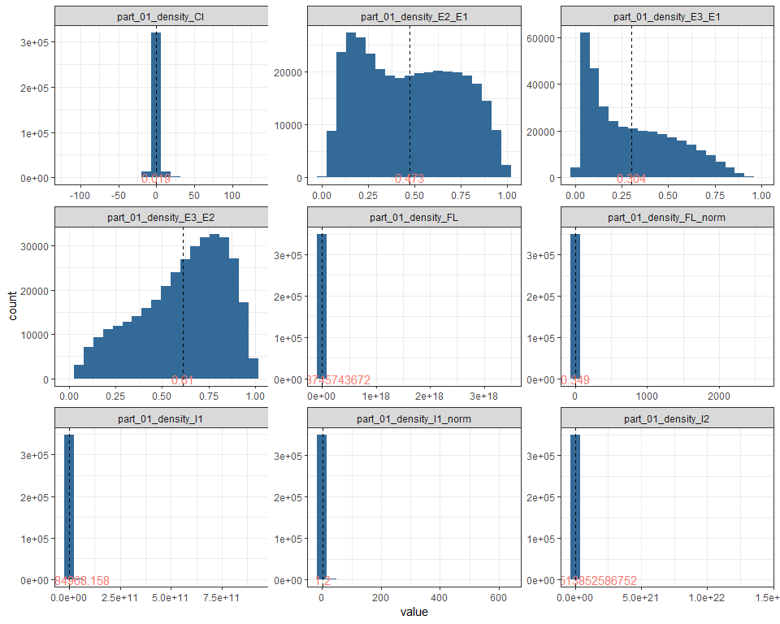
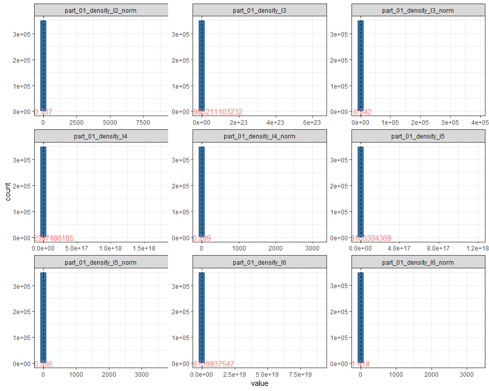
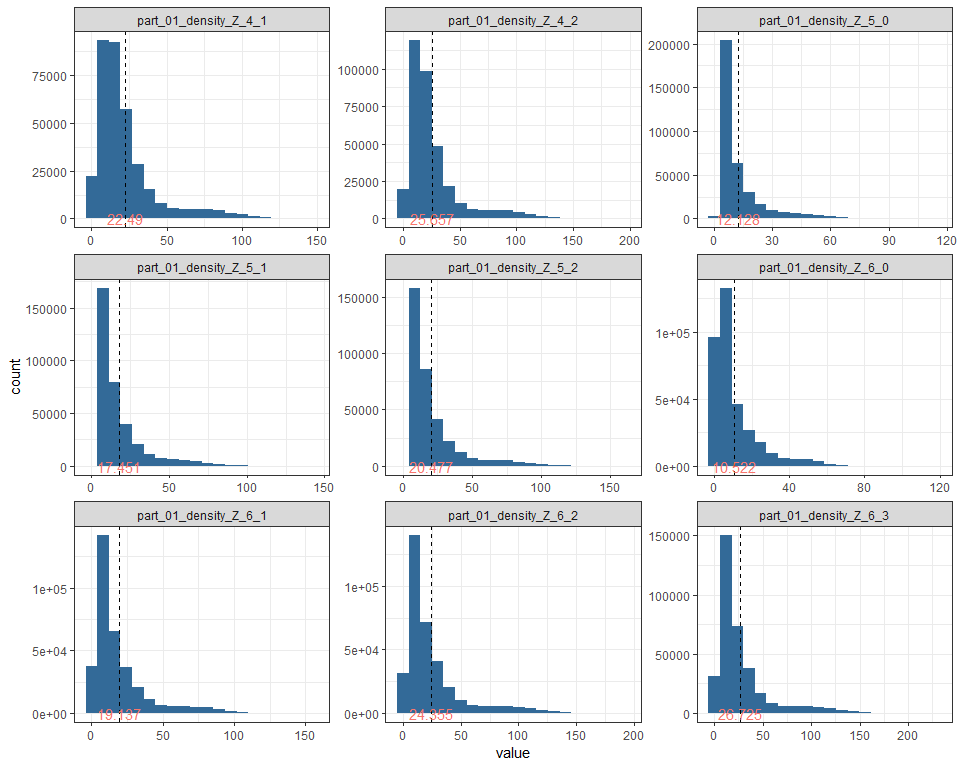
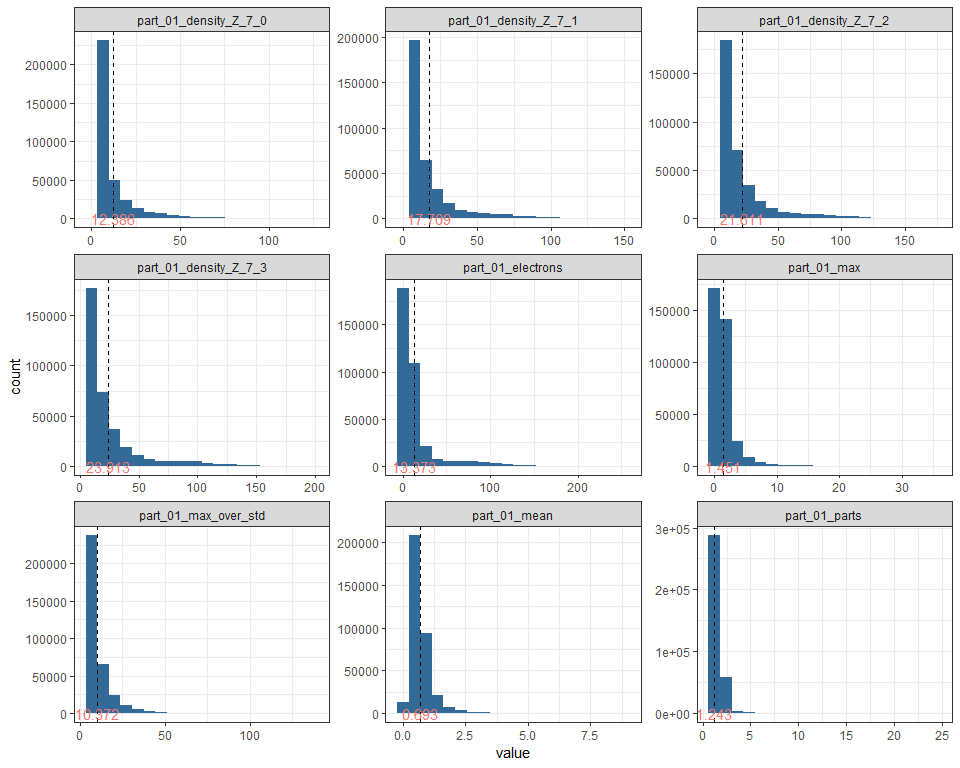
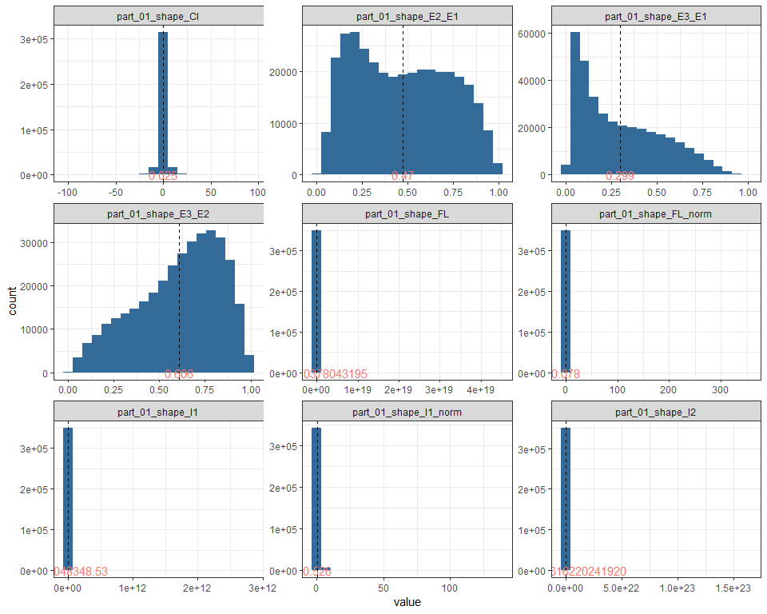
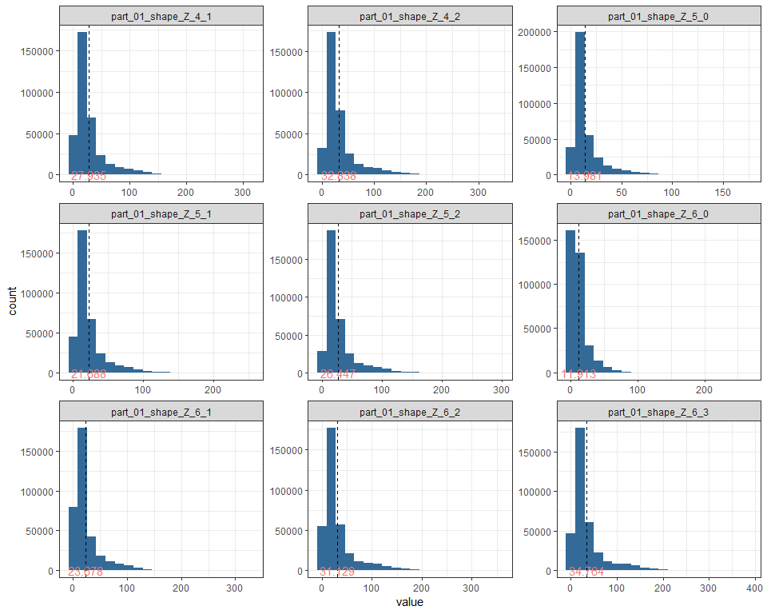
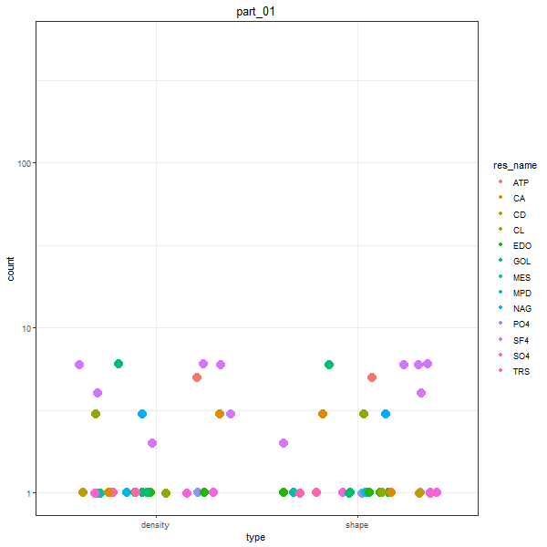

##Podsumowanie analizy

Dane pochodzą z Protein Data Bank, zawierają informację o ligandach. W analizie pominęliśmy kolumnę title, która zawierała powtórzone dane z innych kolumn oraz kolumnę weight_col, która składała się z wartości pustych. Dodatkowo w niektórych wierszach brakowało informacji odnośnie jednego z progów odcięcia. 

##Wykorzystane biblioteki


```r
library(dplyr)
library(ggplot2)
library(ggforce)
library(gganimate) #devtools::install_github('thomasp85/gganimate')
library(tidyr)
library(caret)
library(DT)
library(summarytools)
library(gifski)
library(png)
library(data.table)
```


##Dane

###Powtarzalność wyników

Aby zapewnić powtarzalność wyników ustawiamy stan losowego generatora liczb.


```r
set.seed(123)
```

###Wczytywanie danych

Do wczytania danych używamy funkci "fread", aby zapewnić szybsze wczytanie danych. Kolumna title jest połączeniem kolumn pdb_code, res_name, res_id oraz chain_id, zatem możemy ją usunąć podczas wczytywania, aby uniknąć powtarzania informacji.


```r
all_data <- fread("all_summary.csv", header = TRUE, dec=".", stringsAsFactors = FALSE) %>% select(-(blob_coverage:title))
```

###Przetwarzanie brakujących danych

Wiersze, które w kolumnie "res_name" zawierają niepożądaną przez nas wartość zostają usunięte.


```r
cleaned_data <- all_data %>% filter(!res_name %in% c('UNK', 'UNX', 'UNL', 'DUM', 'N', 'BLOB', 'ALA', 'ARG', 'ASN', 'ASP', 'CYS', 'GLN', 'GLU', 'GLY', 'HIS', 'ILE', 'LEU', 'LYS', 'MET', 'MSE', 'PHE', 'PRO', 'SEC', 'SER', 'THR', 'TRP', 'TYR', 'VAL', 'DA', 'DG', 'DT', 'DC', 'DU', 'A', 'G', 'T', 'C', 'U', 'HOH', 'H20', 'WAT')) 
```

W zbiorze danych występuje kolumna, która równa jest NA we wszystkich wierszach.


```r
rows_without_na_in_weight_co = filter(cleaned_data, !is.na(weight_col))
dim(rows_without_na_in_weight_co)[1]
```

```
## [1] 0
```

Jak widać brak wierszy, których kolumna weight_col nie ma wartości pustej, dlatego możemy ją wykluczyć z dalszej analizy. Usuwamy także wiersze zawierające wartość pustą.


```r
cleaned_data_without_empty_col <- select(cleaned_data, -weight_col)

cleaned_data_without_empty_col <- cleaned_data_without_empty_col[complete.cases(cleaned_data_without_empty_col),]
```

###Rozmiar danych oraz ich statystyki

Zebrane dane zawierają… 408 kolumn oraz 525666 wierszy.
Dane są typu character, numeric, integer. Większość kolumn jest numeryczna. Ich podstawowe statystyki prezentują się tak:

<div data-pagedtable="false">
  <script data-pagedtable-source type="application/json">
{"columns":[{"label":[""],"name":["_rn_"],"type":[""],"align":["left"]},{"label":["Mean"],"name":[1],"type":["dbl"],"align":["right"]},{"label":["Std.Dev"],"name":[2],"type":["dbl"],"align":["right"]},{"label":["Max"],"name":[3],"type":["dbl"],"align":["right"]},{"label":["Min"],"name":[4],"type":["dbl"],"align":["right"]},{"label":["Pct.Valid"],"name":[5],"type":["dbl"],"align":["right"]}],"data":[{"1":"6.658404e-01","2":"2.454925e-01","3":"1.000000e+00","4":"2.004812e-02","5":"100","_rn_":"blob_volume_coverage"},{"1":"2.040204e-02","2":"6.757594e-02","3":"9.988751e-01","4":"0.000000e+00","5":"100","_rn_":"blob_volume_coverage_second"},{"1":"5.244267e-01","2":"2.807117e-01","3":"1.000000e+00","4":"3.634161e-03","5":"100","_rn_":"res_volume_coverage"},{"1":"7.134753e-02","2":"2.083817e-01","3":"1.000000e+00","4":"0.000000e+00","5":"100","_rn_":"res_volume_coverage_second"},{"1":"1.339431e+01","2":"1.534079e+01","3":"1.780000e+02","4":"1.000000e+00","5":"100","_rn_":"local_res_atom_count"},{"1":"1.310963e+01","2":"1.491560e+01","3":"1.110000e+02","4":"1.000000e+00","5":"100","_rn_":"local_res_atom_non_h_count"},{"1":"1.268330e+01","2":"1.468083e+01","3":"1.110000e+02","4":"-7.380000e+00","5":"100","_rn_":"local_res_atom_non_h_occupancy_sum"},{"1":"9.829765e+01","2":"1.006684e+02","3":"1.223000e+03","4":"3.000000e+00","5":"100","_rn_":"local_res_atom_non_h_electron_sum"},{"1":"9.434288e+01","2":"9.874843e+01","3":"8.580000e+02","4":"-4.591000e+01","5":"100","_rn_":"local_res_atom_non_h_electron_occupancy_sum"},{"1":"7.311919e+00","2":"1.048716e+01","3":"8.400000e+01","4":"0.000000e+00","5":"100","_rn_":"local_res_atom_C_count"},{"1":"1.178001e+00","2":"2.115763e+00","3":"2.800000e+01","4":"0.000000e+00","5":"100","_rn_":"local_res_atom_N_count"},{"1":"3.793483e+00","2":"4.042196e+00","3":"5.500000e+01","4":"0.000000e+00","5":"100","_rn_":"local_res_atom_O_count"},{"1":"2.267714e-01","2":"5.333102e-01","3":"1.300000e+01","4":"0.000000e+00","5":"100","_rn_":"local_res_atom_S_count"},{"1":"1.360946e+01","2":"1.551315e+01","3":"1.280000e+02","4":"1.000000e+00","5":"100","_rn_":"dict_atom_non_h_count"},{"1":"1.017735e+02","2":"1.042583e+02","3":"1.223000e+03","4":"3.000000e+00","5":"100","_rn_":"dict_atom_non_h_electron_sum"},{"1":"7.592757e+00","2":"1.103701e+01","3":"9.300000e+01","4":"0.000000e+00","5":"100","_rn_":"dict_atom_C_count"},{"1":"1.189923e+00","2":"2.132439e+00","3":"2.800000e+01","4":"0.000000e+00","5":"100","_rn_":"dict_atom_N_count"},{"1":"3.993315e+00","2":"4.160544e+00","3":"5.500000e+01","4":"0.000000e+00","5":"100","_rn_":"dict_atom_O_count"},{"1":"2.284511e-01","2":"5.367892e-01","3":"1.300000e+01","4":"0.000000e+00","5":"100","_rn_":"dict_atom_S_count"},{"1":"3.961337e-01","2":"9.081229e+00","3":"2.792000e+03","4":"0.000000e+00","5":"100","_rn_":"skeleton_cycle_4"},{"1":"2.528512e+01","2":"3.120409e+01","3":"6.710000e+02","4":"0.000000e+00","5":"100","_rn_":"skeleton_diameter"},{"1":"1.372354e-02","2":"5.423676e-01","3":"1.500000e+02","4":"0.000000e+00","5":"100","_rn_":"skeleton_cycle_6"},{"1":"4.641731e-03","2":"2.600502e-01","3":"5.400000e+01","4":"0.000000e+00","5":"100","_rn_":"skeleton_cycle_7"},{"1":"2.802428e+00","2":"1.537747e+01","3":"4.170000e+02","4":"0.000000e+00","5":"100","_rn_":"skeleton_closeness_006_008"},{"1":"8.917069e-02","2":"3.807622e+00","3":"9.070000e+02","4":"0.000000e+00","5":"100","_rn_":"skeleton_closeness_002_004"},{"1":"6.119475e-02","2":"3.402014e+00","3":"9.570000e+02","4":"0.000000e+00","5":"100","_rn_":"skeleton_cycle_3"},{"1":"1.581186e+00","2":"6.355849e-01","3":"6.458599e+00","4":"0.000000e+00","5":"100","_rn_":"skeleton_avg_degree"},{"1":"1.012398e+00","2":"1.068093e+01","3":"4.920000e+02","4":"0.000000e+00","5":"100","_rn_":"skeleton_closeness_004_006"},{"1":"3.701352e+00","2":"1.199545e+01","3":"7.790000e+02","4":"0.000000e+00","5":"100","_rn_":"skeleton_closeness_010_012"},{"1":"3.430408e+00","2":"1.109183e+01","3":"2.579000e+03","4":"0.000000e+00","5":"100","_rn_":"skeleton_closeness_012_014"},{"1":"3.733242e+01","2":"6.493911e+01","3":"9.934000e+03","4":"0.000000e+00","5":"100","_rn_":"skeleton_edges"},{"1":"1.294326e+01","2":"1.567900e+01","3":"3.360000e+02","4":"0.000000e+00","5":"100","_rn_":"skeleton_radius"},{"1":"2.041848e-01","2":"6.255656e+00","3":"1.863000e+03","4":"0.000000e+00","5":"100","_rn_":"skeleton_cycle_8_plus"},{"1":"5.537250e+00","2":"1.211635e+01","3":"1.009000e+03","4":"0.000000e+00","5":"100","_rn_":"skeleton_closeness_020_030"},{"1":"1.622913e-01","2":"9.675518e+00","3":"2.998000e+03","4":"0.000000e+00","5":"100","_rn_":"skeleton_deg_5_plus"},{"1":"2.336988e+00","2":"6.314355e+00","3":"4.340000e+02","4":"0.000000e+00","5":"100","_rn_":"skeleton_closeness_016_018"},{"1":"3.728854e+00","2":"1.440869e+01","3":"3.040000e+02","4":"0.000000e+00","5":"100","_rn_":"skeleton_closeness_008_010"},{"1":"1.817999e+00","2":"4.902748e+00","3":"5.690000e+02","4":"0.000000e+00","5":"100","_rn_":"skeleton_closeness_018_020"},{"1":"1.318704e-04","2":"3.237196e-03","3":"4.666667e-01","4":"0.000000e+00","5":"100","_rn_":"skeleton_average_clustering"},{"1":"1.913639e+00","2":"6.987152e+00","3":"5.720000e+02","4":"0.000000e+00","5":"100","_rn_":"skeleton_closeness_040_050"},{"1":"2.978386e+00","2":"8.834082e+00","3":"1.290000e+02","4":"0.000000e+00","5":"100","_rn_":"skeleton_closeness_014_016"},{"1":"1.624442e+00","2":"2.174519e+00","3":"2.510000e+02","4":"1.000000e+00","5":"100","_rn_":"skeleton_center"},{"1":"1.121454e-01","2":"5.610104e-01","3":"2.040000e+02","4":"0.000000e+00","5":"100","_rn_":"skeleton_closeness_000_002"},{"1":"2.120883e-01","2":"2.961989e-01","3":"1.000000e+00","4":"0.000000e+00","5":"100","_rn_":"skeleton_density"},{"1":"2.973318e+00","2":"7.846883e+00","3":"8.640000e+02","4":"0.000000e+00","5":"100","_rn_":"skeleton_closeness_030_040"},{"1":"1.278150e-01","2":"1.209543e+00","3":"2.280000e+02","4":"0.000000e+00","5":"100","_rn_":"skeleton_deg_4"},{"1":"1.107243e-01","2":"3.137907e-01","3":"1.000000e+00","4":"0.000000e+00","5":"100","_rn_":"skeleton_deg_0"},{"1":"3.316174e+00","2":"3.565865e+00","3":"8.500000e+01","4":"0.000000e+00","5":"100","_rn_":"skeleton_deg_1"},{"1":"3.177223e+01","2":"4.916979e+01","3":"8.770000e+02","4":"0.000000e+00","5":"100","_rn_":"skeleton_deg_2"},{"1":"2.106543e+00","2":"5.122067e+00","3":"1.570000e+02","4":"0.000000e+00","5":"100","_rn_":"skeleton_deg_3"},{"1":"1.895980e+00","2":"3.276722e-01","3":"5.000000e+00","4":"1.000000e+00","5":"100","_rn_":"skeleton_graph_clique_number"},{"1":"3.759578e+01","2":"5.717839e+01","3":"3.801000e+03","4":"1.000000e+00","5":"100","_rn_":"skeleton_nodes"},{"1":"7.366484e-01","2":"2.038691e+01","3":"6.134000e+03","4":"0.000000e+00","5":"100","_rn_":"skeleton_cycles"},{"1":"5.676989e-02","2":"1.213283e+00","3":"3.200000e+02","4":"0.000000e+00","5":"100","_rn_":"skeleton_cycle_5"},{"1":"5.161441e+00","2":"5.917951e+00","3":"3.100000e+02","4":"0.000000e+00","5":"100","_rn_":"skeleton_closeness_050_plus"},{"1":"2.008975e+00","2":"1.025066e+00","3":"1.010000e+02","4":"1.000000e+00","5":"100","_rn_":"skeleton_periphery"},{"1":"8.990370e+02","2":"1.495739e+03","3":"9.095251e+04","4":"8.390400e+01","5":"100","_rn_":"local_volume"},{"1":"1.884070e+01","2":"2.581614e+01","3":"4.424445e+02","4":"1.782403e-01","5":"100","_rn_":"local_electrons"},{"1":"2.478206e-02","2":"1.891338e-02","3":"4.264420e-01","4":"6.312530e-04","5":"100","_rn_":"local_mean"},{"1":"1.282306e-01","2":"9.722533e-02","3":"1.959560e+00","4":"4.718350e-03","5":"100","_rn_":"local_std"},{"1":"0.000000e+00","2":"0.000000e+00","3":"0.000000e+00","4":"0.000000e+00","5":"100","_rn_":"local_min"},{"1":"1.422955e+00","2":"1.618983e+00","3":"4.463360e+01","4":"4.175460e-02","5":"100","_rn_":"local_max"},{"1":"1.021350e+01","2":"7.694384e+00","3":"1.732520e+02","4":"3.833759e+00","5":"100","_rn_":"local_max_over_std"},{"1":"2.327279e-01","2":"1.924227e-01","3":"4.035155e+00","4":"9.209861e-03","5":"100","_rn_":"local_skewness"},{"1":"3.929836e-01","2":"1.181005e+00","3":"5.350400e+01","4":"0.000000e+00","5":"100","_rn_":"local_cut_by_mainchain_volume"},{"1":"4.624625e+00","2":"6.122369e+00","3":"1.630000e+02","4":"0.000000e+00","5":"100","_rn_":"local_near_cut_count_C"},{"1":"1.266013e-02","2":"1.442281e-01","3":"1.400000e+01","4":"0.000000e+00","5":"100","_rn_":"local_near_cut_count_other"},{"1":"1.303223e-01","2":"5.629369e-01","3":"1.500000e+01","4":"0.000000e+00","5":"100","_rn_":"local_near_cut_count_S"},{"1":"2.209022e+00","2":"2.774063e+00","3":"7.600000e+01","4":"0.000000e+00","5":"100","_rn_":"local_near_cut_count_O"},{"1":"2.302021e+00","2":"2.742412e+00","3":"4.100000e+01","4":"0.000000e+00","5":"100","_rn_":"local_near_cut_count_N"},{"1":"3.573875e+02","2":"1.134621e+03","3":"1.145770e+05","4":"1.000000e+00","5":"100","_rn_":"part_00_shape_segments_count"},{"1":"3.573875e+02","2":"1.134621e+03","3":"1.145770e+05","4":"1.000000e+00","5":"100","_rn_":"part_00_density_segments_count"},{"1":"3.481692e+01","2":"5.171197e+01","3":"2.427944e+03","4":"8.160000e-01","5":"100","_rn_":"part_00_volume"},{"1":"1.862691e+01","2":"2.567461e+01","3":"4.411374e+02","4":"1.782403e-01","5":"100","_rn_":"part_00_electrons"},{"1":"6.208029e-01","2":"4.043475e-01","3":"8.596871e+00","4":"3.289322e-02","5":"100","_rn_":"part_00_mean"},{"1":"2.236614e-01","2":"3.077010e-01","3":"8.010636e+00","4":"2.772348e-03","5":"100","_rn_":"part_00_std"},{"1":"1.422954e+00","2":"1.618983e+00","3":"4.463357e+01","4":"4.175456e-02","5":"100","_rn_":"part_00_max"},{"1":"1.021349e+01","2":"7.694388e+00","3":"1.732520e+02","4":"3.833759e+00","5":"100","_rn_":"part_00_max_over_std"},{"1":"2.305009e-01","2":"3.490926e-01","3":"1.050955e+01","4":"2.465241e-03","5":"100","_rn_":"part_00_skewness"},{"1":"1.071614e+00","2":"3.799176e-01","3":"2.800000e+01","4":"1.000000e+00","5":"100","_rn_":"part_00_parts"},{"1":"1.792380e+06","2":"1.001133e+07","3":"2.628817e+09","4":"7.125196e+02","5":"100","_rn_":"part_00_shape_O3"},{"1":"1.168746e+13","2":"1.073848e+15","3":"4.338385e+17","4":"1.417972e+05","5":"100","_rn_":"part_00_shape_O4"},{"1":"1.986078e+20","2":"5.157788e+22","3":"2.908412e+25","4":"8.148002e+06","5":"100","_rn_":"part_00_shape_O5"},{"1":"6.806109e+16","2":"1.721076e+19","3":"8.380412e+21","4":"1.230356e+04","5":"100","_rn_":"part_00_shape_FL"},{"1":"4.942003e-01","2":"3.170886e-01","3":"3.356957e+01","4":"2.305740e-01","5":"100","_rn_":"part_00_shape_O3_norm"},{"1":"6.255201e-02","2":"7.618066e-02","3":"6.010881e+00","4":"1.771648e-02","5":"100","_rn_":"part_00_shape_O4_norm"},{"1":"2.032509e-03","2":"4.189421e-03","3":"4.110454e-01","4":"4.511187e-04","5":"100","_rn_":"part_00_shape_O5_norm"},{"1":"5.616868e-02","2":"4.609373e-01","3":"1.551444e+02","4":"1.134335e-07","5":"100","_rn_":"part_00_shape_FL_norm"},{"1":"3.145250e+09","2":"3.122786e+11","3":"1.633222e+14","4":"6.959190e+03","5":"100","_rn_":"part_00_shape_I1"},{"1":"3.240074e+20","2":"8.567148e+22","3":"3.583058e+25","4":"8.969091e+06","5":"100","_rn_":"part_00_shape_I2"},{"1":"9.435030e+22","2":"4.323175e+25","3":"2.665214e+28","4":"1.708164e+07","5":"100","_rn_":"part_00_shape_I3"},{"1":"3.826632e+16","2":"9.204644e+18","3":"4.526598e+21","4":"4.948988e+03","5":"100","_rn_":"part_00_shape_I4"},{"1":"1.840314e+16","2":"4.001724e+18","3":"1.957388e+21","4":"6.188604e+00","5":"100","_rn_":"part_00_shape_I5"},{"1":"1.806303e+18","2":"6.362901e+20","3":"3.743294e+23","4":"2.178932e+06","5":"100","_rn_":"part_00_shape_I6"},{"1":"5.478970e-01","2":"3.458002e+00","3":"1.973437e+03","4":"6.322811e-02","5":"100","_rn_":"part_00_shape_I1_norm"},{"1":"9.185134e-02","2":"1.005631e+00","3":"2.563513e+02","4":"1.065698e-03","5":"100","_rn_":"part_00_shape_I2_norm"},{"1":"1.191555e+01","2":"5.778766e+03","3":"3.892018e+06","4":"8.016259e-04","5":"100","_rn_":"part_00_shape_I3_norm"},{"1":"3.797315e-02","2":"4.413398e-01","3":"1.637243e+02","4":"4.590247e-08","5":"100","_rn_":"part_00_shape_I4_norm"},{"1":"2.584281e-02","2":"4.426840e-01","3":"1.809522e+02","4":"1.433671e-10","5":"100","_rn_":"part_00_shape_I5_norm"},{"1":"5.367395e-01","2":"1.026412e+02","3":"6.621913e+04","4":"4.862942e-03","5":"100","_rn_":"part_00_shape_I6_norm"},{"1":"4.352115e+03","2":"6.463996e+03","3":"3.034930e+05","4":"1.020000e+02","5":"100","_rn_":"part_00_shape_M000"},{"1":"5.118089e-02","2":"4.103530e+00","3":"7.004396e+01","4":"-1.294546e+02","5":"100","_rn_":"part_00_shape_CI"},{"1":"2.479334e-01","2":"2.023120e-01","3":"9.947771e-01","4":"9.023962e-05","5":"100","_rn_":"part_00_shape_E3_E1"},{"1":"4.305754e-01","2":"2.440205e-01","3":"1.000000e+00","4":"1.804922e-04","5":"100","_rn_":"part_00_shape_E2_E1"},{"1":"5.553256e-01","2":"2.329147e-01","3":"1.000000e+00","4":"1.144195e-02","5":"100","_rn_":"part_00_shape_E3_E2"},{"1":"8.251156e+00","2":"5.999225e+00","3":"2.027615e+02","4":"1.835481e+00","5":"100","_rn_":"part_00_shape_sqrt_E1"},{"1":"4.574779e+00","2":"2.744781e+00","3":"3.451639e+01","4":"1.225580e+00","5":"100","_rn_":"part_00_shape_sqrt_E2"},{"1":"3.037996e+00","2":"1.410521e+00","3":"2.034265e+01","4":"8.500484e-01","5":"100","_rn_":"part_00_shape_sqrt_E3"},{"1":"8.482039e+05","2":"3.055757e+06","3":"5.673726e+08","4":"2.443813e+02","5":"100","_rn_":"part_00_density_O3"},{"1":"1.465464e+12","2":"4.157537e+13","3":"2.005882e+16","4":"1.925601e+04","5":"100","_rn_":"part_00_density_O4"},{"1":"1.898635e+18","2":"2.847287e+20","3":"1.807559e+23","4":"4.863469e+05","5":"100","_rn_":"part_00_density_O5"},{"1":"4.049750e+15","2":"8.062130e+17","3":"4.048899e+20","4":"3.502160e+03","5":"100","_rn_":"part_00_density_FL"},{"1":"7.300158e-01","2":"6.408511e-01","3":"1.867765e+02","4":"3.559377e-02","5":"100","_rn_":"part_00_density_O3_norm"},{"1":"1.422961e-01","2":"1.999503e-01","3":"1.304209e+01","4":"4.207923e-04","5":"100","_rn_":"part_00_density_O4_norm"},{"1":"7.430512e-03","2":"1.950329e-02","3":"4.430389e+00","4":"1.652895e-06","5":"100","_rn_":"part_00_density_O5_norm"},{"1":"2.744082e-01","2":"2.942819e+00","3":"1.301475e+03","4":"2.253999e-09","5":"100","_rn_":"part_00_density_FL_norm"},{"1":"1.118580e+09","2":"3.508785e+10","3":"1.282083e+13","4":"3.481432e+03","5":"100","_rn_":"part_00_density_I1"},{"1":"1.504415e+19","2":"3.474015e+21","3":"1.508585e+24","4":"3.038293e+06","5":"100","_rn_":"part_00_density_I2"},{"1":"1.091479e+21","2":"3.353102e+23","3":"1.642551e+26","4":"2.851409e+06","5":"100","_rn_":"part_00_density_I3"},{"1":"2.427965e+15","2":"4.550595e+17","3":"2.341520e+20","4":"1.410018e+03","5":"100","_rn_":"part_00_density_I4"},{"1":"1.346775e+15","2":"2.227923e+17","3":"1.203267e+20","4":"1.685112e+00","5":"100","_rn_":"part_00_density_I5"},{"1":"4.439976e+16","2":"1.004454e+19","3":"5.254845e+21","4":"3.001801e+05","5":"100","_rn_":"part_00_density_I6"},{"1":"1.588928e+00","2":"1.034857e+02","3":"6.117316e+04","4":"1.747813e-03","5":"100","_rn_":"part_00_density_I1_norm"},{"1":"7.014181e-01","2":"1.730080e+01","3":"7.616409e+03","4":"8.053168e-07","5":"100","_rn_":"part_00_density_I2_norm"},{"1":"1.070213e+04","2":"5.524743e+06","3":"3.740081e+09","4":"6.251427e-07","5":"100","_rn_":"part_00_density_I3_norm"},{"1":"2.081347e-01","2":"2.725833e+00","3":"1.301025e+03","4":"2.002683e-09","5":"100","_rn_":"part_00_density_I4_norm"},{"1":"1.639523e-01","2":"2.641155e+00","3":"1.300724e+03","4":"1.637857e-10","5":"100","_rn_":"part_00_density_I5_norm"},{"1":"3.823134e+01","2":"1.768438e+04","3":"1.142138e+07","4":"2.090699e-05","5":"100","_rn_":"part_00_density_I6_norm"},{"1":"2.328364e+03","2":"3.209327e+03","3":"5.514218e+04","4":"2.228004e+01","5":"100","_rn_":"part_00_density_M000"},{"1":"5.295638e-02","2":"4.701896e+00","3":"8.996053e+01","4":"-1.557014e+02","5":"100","_rn_":"part_00_density_CI"},{"1":"2.509819e-01","2":"2.084986e-01","3":"9.958993e-01","4":"8.103539e-05","5":"100","_rn_":"part_00_density_E3_E1"},{"1":"4.307965e-01","2":"2.478940e-01","3":"9.999999e-01","4":"1.592824e-04","5":"100","_rn_":"part_00_density_E2_E1"},{"1":"5.575807e-01","2":"2.363949e-01","3":"1.000000e+00","4":"1.305281e-02","5":"100","_rn_":"part_00_density_E3_E2"},{"1":"7.911170e+00","2":"5.887528e+00","3":"2.024823e+02","4":"1.502875e+00","5":"100","_rn_":"part_00_density_sqrt_E1"},{"1":"4.334888e+00","2":"2.651020e+00","3":"3.297918e+01","4":"1.178654e+00","5":"100","_rn_":"part_00_density_sqrt_E2"},{"1":"2.863812e+00","2":"1.332664e+00","3":"1.937850e+01","4":"8.344182e-01","5":"100","_rn_":"part_00_density_sqrt_E3"},{"1":"4.252817e+01","2":"3.685245e+01","3":"5.587070e+02","4":"7.415174e+00","5":"100","_rn_":"part_00_shape_Z_7_3"},{"1":"2.719574e+01","2":"1.730269e+01","3":"2.691721e+02","4":"4.934643e+00","5":"100","_rn_":"part_00_shape_Z_0_0"},{"1":"1.793437e+01","2":"1.697320e+01","3":"3.669917e+02","4":"8.462635e-01","5":"100","_rn_":"part_00_shape_Z_7_0"},{"1":"2.921799e+01","2":"2.622383e+01","3":"4.461359e+02","4":"3.661825e+00","5":"100","_rn_":"part_00_shape_Z_7_1"},{"1":"1.560936e+01","2":"1.311713e+01","3":"2.081280e+02","4":"5.714221e-01","5":"100","_rn_":"part_00_shape_Z_3_0"},{"1":"3.631222e+01","2":"2.931488e+01","3":"4.551012e+02","4":"5.541350e+00","5":"100","_rn_":"part_00_shape_Z_5_2"},{"1":"3.286921e+01","2":"2.888028e+01","3":"4.762128e+02","4":"1.884072e+00","5":"100","_rn_":"part_00_shape_Z_6_1"},{"1":"2.532758e+01","2":"1.913678e+01","3":"2.972758e+02","4":"3.137063e+00","5":"100","_rn_":"part_00_shape_Z_3_1"},{"1":"1.536083e+01","2":"1.423309e+01","3":"2.990133e+02","4":"2.436426e-02","5":"100","_rn_":"part_00_shape_Z_6_0"},{"1":"3.970931e+01","2":"2.795054e+01","3":"4.208093e+02","4":"2.749072e+00","5":"100","_rn_":"part_00_shape_Z_2_1"},{"1":"4.823190e+01","2":"4.114765e+01","3":"6.084310e+02","4":"5.240133e+00","5":"100","_rn_":"part_00_shape_Z_6_3"},{"1":"2.920899e+01","2":"1.998656e+01","3":"3.265259e+02","4":"1.322838e+00","5":"100","_rn_":"part_00_shape_Z_2_0"},{"1":"4.357451e+01","2":"3.776903e+01","3":"5.622022e+02","4":"3.576604e+00","5":"100","_rn_":"part_00_shape_Z_6_2"},{"1":"1.893718e+01","2":"1.736492e+01","3":"3.155733e+02","4":"7.928717e-01","5":"100","_rn_":"part_00_shape_Z_5_0"},{"1":"3.004378e+01","2":"2.478306e+01","3":"4.074941e+02","4":"3.722554e+00","5":"100","_rn_":"part_00_shape_Z_5_1"},{"1":"4.538360e+01","2":"3.613193e+01","3":"5.344744e+02","4":"4.918585e+00","5":"100","_rn_":"part_00_shape_Z_4_2"},{"1":"1.417207e+00","2":"2.081162e-01","3":"2.291631e+00","4":"7.373045e-01","5":"100","_rn_":"part_00_shape_Z_1_0"},{"1":"3.906086e+01","2":"3.161261e+01","3":"4.656008e+02","4":"3.269346e+00","5":"100","_rn_":"part_00_shape_Z_4_1"},{"1":"3.781948e+01","2":"3.342010e+01","3":"5.303216e+02","4":"5.741844e+00","5":"100","_rn_":"part_00_shape_Z_7_2"},{"1":"2.126774e+01","2":"1.776069e+01","3":"3.130934e+02","4":"2.954764e-02","5":"100","_rn_":"part_00_shape_Z_4_0"},{"1":"3.159887e+01","2":"2.783832e+01","3":"2.111186e+02","4":"5.734949e+00","5":"100","_rn_":"part_00_density_Z_7_3"},{"1":"1.995668e+01","2":"1.255337e+01","3":"1.147355e+02","4":"2.306289e+00","5":"100","_rn_":"part_00_density_Z_0_0"},{"1":"1.541844e+01","2":"1.397828e+01","3":"1.269188e+02","4":"9.849014e-01","5":"100","_rn_":"part_00_density_Z_7_0"},{"1":"2.324643e+01","2":"2.067090e+01","3":"1.599191e+02","4":"3.060651e+00","5":"100","_rn_":"part_00_density_Z_7_1"},{"1":"1.176474e+01","2":"9.824105e+00","3":"8.853860e+01","4":"4.419361e-01","5":"100","_rn_":"part_00_density_Z_3_0"},{"1":"2.664518e+01","2":"2.175423e+01","3":"1.821830e+02","4":"3.898698e+00","5":"100","_rn_":"part_00_density_Z_5_2"},{"1":"2.585313e+01","2":"2.279435e+01","3":"1.960675e+02","4":"1.219508e+00","5":"100","_rn_":"part_00_density_Z_6_1"},{"1":"1.804193e+01","2":"1.395068e+01","3":"1.208636e+02","4":"2.047835e+00","5":"100","_rn_":"part_00_density_Z_3_1"},{"1":"1.316316e+01","2":"1.273557e+01","3":"1.224934e+02","4":"7.071928e-03","5":"100","_rn_":"part_00_density_Z_6_0"},{"1":"2.931513e+01","2":"2.003420e+01","3":"1.763805e+02","4":"2.498912e+00","5":"100","_rn_":"part_00_density_Z_2_1"},{"1":"3.576395e+01","2":"3.100874e+01","3":"2.828048e+02","4":"2.120202e+00","5":"100","_rn_":"part_00_density_Z_6_3"},{"1":"2.262689e+01","2":"1.479850e+01","3":"1.352767e+02","4":"2.201719e+00","5":"100","_rn_":"part_00_density_Z_2_0"},{"1":"3.292727e+01","2":"2.877286e+01","3":"2.638942e+02","4":"1.779659e+00","5":"100","_rn_":"part_00_density_Z_6_2"},{"1":"1.551183e+01","2":"1.362169e+01","3":"1.182292e+02","4":"8.740978e-01","5":"100","_rn_":"part_00_density_Z_5_0"},{"1":"2.282714e+01","2":"1.872264e+01","3":"1.670804e+02","4":"2.836799e+00","5":"100","_rn_":"part_00_density_Z_5_1"},{"1":"3.371668e+01","2":"2.632032e+01","3":"2.366704e+02","4":"1.958959e+00","5":"100","_rn_":"part_00_density_Z_4_2"},{"1":"1.407325e+00","2":"2.121015e-01","3":"2.287544e+00","4":"6.768044e-01","5":"100","_rn_":"part_00_density_Z_1_0"},{"1":"2.984253e+01","2":"2.324309e+01","3":"2.045134e+02","4":"9.170305e-01","5":"100","_rn_":"part_00_density_Z_4_1"},{"1":"2.879128e+01","2":"2.556334e+01","3":"1.951190e+02","4":"5.013981e+00","5":"100","_rn_":"part_00_density_Z_7_2"},{"1":"1.786741e+01","2":"1.411018e+01","3":"1.225763e+02","4":"7.392274e-03","5":"100","_rn_":"part_00_density_Z_4_0"},{"1":"2.990925e+02","2":"9.906929e+02","3":"6.920200e+04","4":"0.000000e+00","5":"100","_rn_":"part_01_shape_segments_count"},{"1":"2.990925e+02","2":"9.906929e+02","3":"6.920200e+04","4":"0.000000e+00","5":"100","_rn_":"part_01_density_segments_count"},{"1":"2.694832e+01","2":"4.216297e+01","3":"1.996248e+03","4":"5.360000e-01","5":"100","_rn_":"part_01_volume"},{"1":"1.609065e+01","2":"2.339498e+01","3":"3.956953e+02","4":"9.564205e-02","5":"100","_rn_":"part_01_electrons"},{"1":"6.765141e-01","2":"4.331278e-01","3":"8.857451e+00","4":"3.603609e-02","5":"100","_rn_":"part_01_mean"},{"1":"2.133041e-01","2":"3.117049e-01","3":"8.075436e+00","4":"1.829592e-03","5":"100","_rn_":"part_01_std"},{"1":"1.422954e+00","2":"1.618983e+00","3":"4.463357e+01","4":"4.175456e-02","5":"100","_rn_":"part_01_max"},{"1":"1.021349e+01","2":"7.694388e+00","3":"1.732520e+02","4":"3.833759e+00","5":"100","_rn_":"part_01_max_over_std"},{"1":"2.173772e-01","2":"3.485386e-01","3":"1.076795e+01","4":"1.070605e-03","5":"100","_rn_":"part_01_skewness"},{"1":"1.291073e+00","2":"7.083706e-01","3":"2.400000e+01","4":"1.000000e+00","5":"100","_rn_":"part_01_parts"},{"1":"1.343518e+06","2":"7.744394e+06","3":"2.085834e+09","4":"2.994412e+02","5":"100","_rn_":"part_01_shape_O3"},{"1":"6.380835e+12","2":"5.614323e+14","3":"2.632982e+17","4":"2.599932e+04","5":"100","_rn_":"part_01_shape_O4"},{"1":"6.863732e+19","2":"1.657961e+22","3":"8.480462e+24","4":"6.851155e+05","5":"100","_rn_":"part_01_shape_O5"},{"1":"3.759482e+16","2":"9.759900e+18","3":"5.267348e+21","4":"1.644106e+03","5":"100","_rn_":"part_01_shape_FL"},{"1":"5.335990e-01","2":"4.045889e-01","3":"3.843484e+01","4":"2.302086e-01","5":"100","_rn_":"part_01_shape_O3_norm"},{"1":"7.367018e-02","2":"1.111839e-01","3":"1.175143e+01","4":"1.765292e-02","5":"100","_rn_":"part_01_shape_O4_norm"},{"1":"2.612647e-03","2":"7.323063e-03","3":"1.231612e+00","4":"4.429106e-04","5":"100","_rn_":"part_01_shape_O5_norm"},{"1":"1.264410e-01","2":"1.702981e+00","3":"5.526108e+02","4":"1.117884e-07","5":"100","_rn_":"part_01_shape_FL_norm"},{"1":"2.367876e+09","2":"2.486583e+11","3":"1.307399e+14","4":"1.724445e+03","5":"100","_rn_":"part_01_shape_I1"},{"1":"1.699563e+20","2":"4.500067e+22","3":"1.923967e+25","4":"5.913334e+05","5":"100","_rn_":"part_01_shape_I2"},{"1":"6.008757e+22","2":"2.779798e+25","3":"1.708172e+28","4":"7.270141e+05","5":"100","_rn_":"part_01_shape_I3"},{"1":"2.146470e+16","2":"5.343137e+18","3":"2.998393e+21","4":"8.843629e+02","5":"100","_rn_":"part_01_shape_I4"},{"1":"1.071129e+16","2":"2.461186e+18","3":"1.485756e+21","4":"3.107109e+00","5":"100","_rn_":"part_01_shape_I5"},{"1":"1.131738e+18","2":"4.072149e+20","3":"2.400810e+23","4":"2.070981e+05","5":"100","_rn_":"part_01_shape_I6"},{"1":"7.311862e-01","2":"5.015405e+00","3":"2.592416e+03","4":"6.300770e-02","5":"100","_rn_":"part_01_shape_I1_norm"},{"1":"2.085263e-01","2":"4.705944e+00","3":"1.639307e+03","4":"1.057816e-03","5":"100","_rn_":"part_01_shape_I2_norm"},{"1":"2.499551e+01","2":"1.049436e+04","3":"6.717223e+06","4":"8.006931e-04","5":"100","_rn_":"part_01_shape_I3_norm"},{"1":"1.000560e-01","2":"1.694958e+00","3":"6.056131e+02","4":"5.422548e-08","5":"100","_rn_":"part_01_shape_I4_norm"},{"1":"8.246605e-02","2":"1.716015e+00","3":"6.409480e+02","4":"2.900977e-11","5":"100","_rn_":"part_01_shape_I5_norm"},{"1":"9.726745e-01","2":"1.655969e+02","3":"9.960460e+04","4":"4.843120e-03","5":"100","_rn_":"part_01_shape_I6_norm"},{"1":"3.368540e+03","2":"5.270372e+03","3":"2.495310e+05","4":"6.700000e+01","5":"100","_rn_":"part_01_shape_M000"},{"1":"4.108352e-02","2":"4.574655e+00","3":"9.132459e+01","4":"-1.426431e+02","5":"100","_rn_":"part_01_shape_CI"},{"1":"2.557574e-01","2":"2.129283e-01","3":"9.936374e-01","4":"7.307081e-05","5":"100","_rn_":"part_01_shape_E3_E1"},{"1":"4.313210e-01","2":"2.531958e-01","3":"1.000000e+00","4":"1.467917e-04","5":"100","_rn_":"part_01_shape_E2_E1"},{"1":"5.643309e-01","2":"2.384504e-01","3":"1.000000e+00","4":"9.098147e-03","5":"100","_rn_":"part_01_shape_E3_E2"},{"1":"7.696303e+00","2":"6.021834e+00","3":"2.023697e+02","4":"1.300334e+00","5":"100","_rn_":"part_01_shape_sqrt_E1"},{"1":"4.181624e+00","2":"2.730343e+00","3":"3.286796e+01","4":"9.551653e-01","5":"100","_rn_":"part_01_shape_sqrt_E2"},{"1":"2.763549e+00","2":"1.389949e+00","3":"1.936045e+01","4":"6.897232e-01","5":"100","_rn_":"part_01_shape_sqrt_E3"},{"1":"7.105127e+05","2":"2.655935e+06","3":"4.912020e+08","4":"1.089592e+02","5":"100","_rn_":"part_01_density_O3"},{"1":"1.071000e+12","2":"2.997202e+13","3":"1.459115e+16","4":"3.857428e+03","5":"100","_rn_":"part_01_density_O4"},{"1":"1.138260e+18","2":"1.716813e+20","3":"1.102507e+23","4":"4.101285e+04","5":"100","_rn_":"part_01_density_O5"},{"1":"2.951413e+15","2":"5.910816e+17","3":"2.970710e+20","4":"1.454035e+02","5":"100","_rn_":"part_01_density_FL"},{"1":"7.523823e-01","2":"7.686563e-01","3":"2.057351e+02","4":"3.547024e-02","5":"100","_rn_":"part_01_density_O3_norm"},{"1":"1.515982e-01","2":"2.675780e-01","3":"2.842351e+01","4":"4.179190e-04","5":"100","_rn_":"part_01_density_O4_norm"},{"1":"8.107709e-03","2":"2.833628e-02","3":"3.736341e+00","4":"1.636233e-06","5":"100","_rn_":"part_01_density_O5_norm"},{"1":"5.929583e-01","2":"1.136763e+01","3":"4.725470e+03","4":"1.191603e-09","5":"100","_rn_":"part_01_density_FL_norm"},{"1":"9.329664e+08","2":"2.991852e+10","3":"1.098793e+13","4":"9.165359e+02","5":"100","_rn_":"part_01_density_I1"},{"1":"1.048692e+19","2":"2.442372e+21","3":"9.956763e+23","4":"2.189768e+05","5":"100","_rn_":"part_01_density_I2"},{"1":"7.984162e+20","2":"2.445424e+23","3":"1.206633e+26","4":"1.765397e+05","5":"100","_rn_":"part_01_density_I3"},{"1":"1.819510e+15","2":"3.454708e+17","3":"1.786501e+20","4":"9.967279e+01","5":"100","_rn_":"part_01_density_I4"},{"1":"1.064908e+15","2":"1.832197e+17","3":"9.970288e+19","4":"1.250652e-01","5":"100","_rn_":"part_01_density_I5"},{"1":"3.289488e+16","2":"7.409643e+18","3":"3.827444e+21","4":"3.393291e+04","5":"100","_rn_":"part_01_density_I6"},{"1":"1.994386e+00","2":"1.391275e+02","3":"7.434489e+04","4":"1.730776e-03","5":"100","_rn_":"part_01_density_I1_norm"},{"1":"1.650945e+00","2":"9.832671e+01","3":"4.906154e+04","4":"7.899698e-07","5":"100","_rn_":"part_01_density_I2_norm"},{"1":"1.934526e+04","2":"8.879390e+06","3":"5.524616e+09","4":"6.126379e-07","5":"100","_rn_":"part_01_density_I3_norm"},{"1":"5.169945e-01","2":"1.178813e+01","3":"4.724682e+03","4":"1.448060e-09","5":"100","_rn_":"part_01_density_I4_norm"},{"1":"4.663520e-01","2":"1.222336e+01","3":"4.724157e+03","4":"6.213496e-11","5":"100","_rn_":"part_01_density_I5_norm"},{"1":"6.171100e+01","2":"2.616441e+04","3":"1.529053e+07","4":"2.062969e-05","5":"100","_rn_":"part_01_density_I6_norm"},{"1":"2.011332e+03","2":"2.924373e+03","3":"4.946192e+04","4":"1.195526e+01","5":"100","_rn_":"part_01_density_M000"},{"1":"4.126540e-02","2":"5.158623e+00","3":"1.263449e+02","4":"-1.625800e+02","5":"100","_rn_":"part_01_density_CI"},{"1":"2.587425e-01","2":"2.176611e-01","3":"9.967620e-01","4":"6.708289e-05","5":"100","_rn_":"part_01_density_E3_E1"},{"1":"4.319415e-01","2":"2.560743e-01","3":"1.000000e+00","4":"1.332634e-04","5":"100","_rn_":"part_01_density_E2_E1"},{"1":"5.667003e-01","2":"2.409728e-01","3":"1.000000e+00","4":"9.983717e-03","5":"100","_rn_":"part_01_density_E3_E2"},{"1":"7.414022e+00","2":"5.903679e+00","3":"2.021732e+02","4":"1.264761e+00","5":"100","_rn_":"part_01_density_sqrt_E1"},{"1":"3.987418e+00","2":"2.638202e+00","3":"3.314079e+01","4":"9.347636e-01","5":"100","_rn_":"part_01_density_sqrt_E2"},{"1":"2.625456e+00","2":"1.318688e+00","3":"1.869135e+01","4":"6.869379e-01","5":"100","_rn_":"part_01_density_sqrt_E3"},{"1":"3.711597e+01","2":"3.417482e+01","3":"4.702780e+02","4":"6.190899e+00","5":"100","_rn_":"part_01_shape_Z_7_3"},{"1":"2.344200e+01","2":"1.595784e+01","3":"2.440720e+02","4":"3.999384e+00","5":"100","_rn_":"part_01_shape_Z_0_0"},{"1":"1.636936e+01","2":"1.573210e+01","3":"2.915568e+02","4":"7.064404e-01","5":"100","_rn_":"part_01_shape_Z_7_0"},{"1":"2.577653e+01","2":"2.434228e+01","3":"3.709863e+02","4":"3.907034e+00","5":"100","_rn_":"part_01_shape_Z_7_1"},{"1":"1.388028e+01","2":"1.234172e+01","3":"1.917558e+02","4":"6.282219e-01","5":"100","_rn_":"part_01_shape_Z_3_0"},{"1":"3.142759e+01","2":"2.721634e+01","3":"4.032965e+02","4":"4.559315e+00","5":"100","_rn_":"part_01_shape_Z_5_2"},{"1":"2.850321e+01","2":"2.695842e+01","3":"3.717027e+02","4":"1.344012e+00","5":"100","_rn_":"part_01_shape_Z_6_1"},{"1":"2.212896e+01","2":"1.785668e+01","3":"2.606736e+02","4":"2.574127e+00","5":"100","_rn_":"part_01_shape_Z_3_1"},{"1":"1.365293e+01","2":"1.364277e+01","3":"2.636183e+02","4":"1.809011e-02","5":"100","_rn_":"part_01_shape_Z_6_0"},{"1":"3.407507e+01","2":"2.580666e+01","3":"3.463773e+02","4":"2.490305e+00","5":"100","_rn_":"part_01_shape_Z_2_1"},{"1":"4.179190e+01","2":"3.824535e+01","3":"5.371829e+02","4":"4.204433e+00","5":"100","_rn_":"part_01_shape_Z_6_3"},{"1":"2.487862e+01","2":"1.854953e+01","3":"2.893659e+02","4":"3.656142e-01","5":"100","_rn_":"part_01_shape_Z_2_0"},{"1":"3.757996e+01","2":"3.505083e+01","3":"4.949405e+02","4":"3.060808e+00","5":"100","_rn_":"part_01_shape_Z_6_2"},{"1":"1.690152e+01","2":"1.616550e+01","3":"2.952350e+02","4":"7.448829e-01","5":"100","_rn_":"part_01_shape_Z_5_0"},{"1":"2.588951e+01","2":"2.294699e+01","3":"3.681261e+02","4":"3.226679e+00","5":"100","_rn_":"part_01_shape_Z_5_1"},{"1":"3.891615e+01","2":"3.347377e+01","3":"4.505036e+02","4":"3.394632e+00","5":"100","_rn_":"part_01_shape_Z_4_2"},{"1":"1.508229e+00","2":"2.680214e-01","3":"3.428337e+00","4":"7.036783e-01","5":"100","_rn_":"part_01_shape_Z_1_0"},{"1":"3.325072e+01","2":"2.927144e+01","3":"3.814826e+02","4":"1.850828e+00","5":"100","_rn_":"part_01_shape_Z_4_1"},{"1":"3.287714e+01","2":"3.088485e+01","3":"4.472704e+02","4":"5.045789e+00","5":"100","_rn_":"part_01_shape_Z_7_2"},{"1":"1.816548e+01","2":"1.672313e+01","3":"2.751724e+02","4":"2.103600e-02","5":"100","_rn_":"part_01_shape_Z_4_0"},{"1":"2.903641e+01","2":"2.698330e+01","3":"2.030543e+02","4":"5.049210e+00","5":"100","_rn_":"part_01_density_Z_7_3"},{"1":"1.813162e+01","2":"1.230507e+01","3":"1.086654e+02","4":"1.689410e+00","5":"100","_rn_":"part_01_density_Z_0_0"},{"1":"1.459973e+01","2":"1.346461e+01","3":"1.251703e+02","4":"6.196770e-01","5":"100","_rn_":"part_01_density_Z_7_0"},{"1":"2.145606e+01","2":"1.999474e+01","3":"1.556780e+02","4":"3.059072e+00","5":"100","_rn_":"part_01_density_Z_7_1"},{"1":"1.103127e+01","2":"9.642016e+00","3":"8.631976e+01","4":"4.401992e-01","5":"100","_rn_":"part_01_density_Z_3_0"},{"1":"2.435228e+01","2":"2.118703e+01","3":"1.804896e+02","4":"3.653685e+00","5":"100","_rn_":"part_01_density_Z_5_2"},{"1":"2.314334e+01","2":"2.226908e+01","3":"1.910917e+02","4":"7.436685e-01","5":"100","_rn_":"part_01_density_Z_6_1"},{"1":"1.669922e+01","2":"1.365974e+01","3":"1.174498e+02","4":"2.440885e+00","5":"100","_rn_":"part_01_density_Z_3_1"},{"1":"1.190747e+01","2":"1.260045e+01","3":"1.174541e+02","4":"7.128359e-03","5":"100","_rn_":"part_01_density_Z_6_0"},{"1":"2.649457e+01","2":"1.957994e+01","3":"1.709210e+02","4":"1.480239e+00","5":"100","_rn_":"part_01_density_Z_2_1"},{"1":"3.231793e+01","2":"3.020867e+01","3":"2.703135e+02","4":"1.455363e+00","5":"100","_rn_":"part_01_density_Z_6_3"},{"1":"2.027508e+01","2":"1.459060e+01","3":"1.281325e+02","4":"7.497167e-01","5":"100","_rn_":"part_01_density_Z_2_0"},{"1":"2.954097e+01","2":"2.798682e+01","3":"2.535044e+02","4":"1.131855e+00","5":"100","_rn_":"part_01_density_Z_6_2"},{"1":"1.444358e+01","2":"1.323110e+01","3":"1.146307e+02","4":"6.775005e-01","5":"100","_rn_":"part_01_density_Z_5_0"},{"1":"2.074644e+01","2":"1.818554e+01","3":"1.648664e+02","4":"2.318935e+00","5":"100","_rn_":"part_01_density_Z_5_1"},{"1":"3.024130e+01","2":"2.575362e+01","3":"2.247522e+02","4":"1.556611e+00","5":"100","_rn_":"part_01_density_Z_4_2"},{"1":"1.499543e+00","2":"2.724867e-01","3":"3.422873e+00","4":"6.245716e-01","5":"100","_rn_":"part_01_density_Z_1_0"},{"1":"2.650471e+01","2":"2.277683e+01","3":"1.961613e+02","4":"1.027491e+00","5":"100","_rn_":"part_01_density_Z_4_1"},{"1":"2.632042e+01","2":"2.468718e+01","3":"1.917016e+02","4":"4.435599e+00","5":"100","_rn_":"part_01_density_Z_7_2"},{"1":"1.573045e+01","2":"1.407924e+01","3":"1.204581e+02","4":"5.116129e-03","5":"100","_rn_":"part_01_density_Z_4_0"},{"1":"2.508333e+02","2":"8.699784e+02","3":"4.556400e+04","4":"0.000000e+00","5":"100","_rn_":"part_02_shape_segments_count"},{"1":"2.508333e+02","2":"8.699784e+02","3":"4.556400e+04","4":"0.000000e+00","5":"100","_rn_":"part_02_density_segments_count"},{"1":"2.085075e+01","2":"3.474457e+01","3":"1.632536e+03","4":"2.560000e-01","5":"100","_rn_":"part_02_volume"},{"1":"1.377264e+01","2":"2.115630e+01","3":"3.511867e+02","4":"2.030684e-02","5":"100","_rn_":"part_02_electrons"},{"1":"7.306502e-01","2":"4.603257e-01","3":"9.763456e+00","4":"3.941826e-02","5":"100","_rn_":"part_02_mean"},{"1":"2.023785e-01","2":"3.152954e-01","3":"8.262894e+00","4":"2.455243e-04","5":"100","_rn_":"part_02_std"},{"1":"1.422948e+00","2":"1.618984e+00","3":"4.463357e+01","4":"4.175456e-02","5":"100","_rn_":"part_02_max"},{"1":"1.021346e+01","2":"7.694407e+00","3":"1.732520e+02","4":"3.833759e+00","5":"100","_rn_":"part_02_max_over_std"},{"1":"2.042056e-01","2":"3.480561e-01","3":"1.089157e+01","4":"1.703526e-04","5":"100","_rn_":"part_02_skewness"},{"1":"1.393421e+00","2":"9.032838e-01","3":"2.800000e+01","4":"1.000000e+00","5":"100","_rn_":"part_02_parts"},{"1":"1.007753e+06","2":"6.057379e+06","3":"1.668045e+09","4":"7.431250e+01","5":"100","_rn_":"part_02_shape_O3"},{"1":"3.643158e+12","2":"3.200081e+14","3":"1.649676e+17","4":"1.808750e+03","5":"100","_rn_":"part_02_shape_O4"},{"1":"2.704061e+19","2":"6.960650e+21","3":"4.147785e+24","4":"1.228800e+04","5":"100","_rn_":"part_02_shape_O5"},{"1":"2.110632e+16","2":"5.753105e+18","3":"3.330358e+21","4":"-6.115936e+01","5":"100","_rn_":"part_02_shape_FL"},{"1":"5.711057e-01","2":"5.463102e-01","3":"6.888374e+01","4":"2.269146e-01","5":"100","_rn_":"part_02_shape_O3_norm"},{"1":"8.681105e-02","2":"1.739314e-01","3":"2.169251e+01","4":"1.698601e-02","5":"100","_rn_":"part_02_shape_O4_norm"},{"1":"3.460632e-03","2":"1.723877e-02","3":"6.417807e+00","4":"3.662109e-04","5":"100","_rn_":"part_02_shape_O5_norm"},{"1":"3.516390e-01","2":"9.276246e+00","3":"3.374842e+03","4":"-1.917847e-05","5":"100","_rn_":"part_02_shape_FL_norm"},{"1":"1.776034e+09","2":"1.943853e+11","3":"1.057686e+14","4":"2.064160e+02","5":"100","_rn_":"part_02_shape_I1"},{"1":"9.365791e+19","2":"2.523605e+22","3":"1.085535e+25","4":"1.087504e+04","5":"100","_rn_":"part_02_shape_I2"},{"1":"3.680927e+22","2":"1.744411e+25","3":"1.118111e+28","4":"9.186615e+03","5":"100","_rn_":"part_02_shape_I3"},{"1":"1.237077e+16","2":"3.289455e+18","3":"1.981339e+21","4":"-2.156397e+01","5":"100","_rn_":"part_02_shape_I4"},{"1":"6.547068e+15","2":"1.683199e+18","3":"1.081993e+21","4":"0.000000e+00","5":"100","_rn_":"part_02_shape_I5"},{"1":"6.930194e+17","2":"2.554004e+20","3":"1.572613e+23","4":"5.232474e+03","5":"100","_rn_":"part_02_shape_I6"},{"1":"1.027725e+00","2":"1.356373e+01","3":"8.356552e+03","4":"6.024977e-02","5":"100","_rn_":"part_02_shape_I1_norm"},{"1":"8.119865e-01","2":"9.695024e+01","3":"4.807317e+04","4":"9.412416e-04","5":"100","_rn_":"part_02_shape_I2_norm"},{"1":"1.832801e+02","2":"9.851794e+04","3":"6.981922e+07","4":"7.515554e-04","5":"100","_rn_":"part_02_shape_I3_norm"},{"1":"3.169492e-01","2":"9.481212e+00","3":"3.367004e+03","4":"-6.478742e-06","5":"100","_rn_":"part_02_shape_I4_norm"},{"1":"2.938227e-01","2":"9.672757e+00","3":"3.361778e+03","4":"0.000000e+00","5":"100","_rn_":"part_02_shape_I5_norm"},{"1":"3.033492e+00","2":"8.369480e+02","3":"5.755581e+05","4":"4.609745e-03","5":"100","_rn_":"part_02_shape_I6_norm"},{"1":"2.606343e+03","2":"4.343072e+03","3":"2.040670e+05","4":"3.200000e+01","5":"100","_rn_":"part_02_shape_M000"},{"1":"3.041179e-02","2":"4.849279e+00","3":"1.470381e+02","4":"-1.537477e+02","5":"100","_rn_":"part_02_shape_CI"},{"1":"2.701690e-01","2":"2.211250e-01","3":"9.950984e-01","4":"3.085698e-05","5":"100","_rn_":"part_02_shape_E3_E1"},{"1":"4.405629e-01","2":"2.602767e-01","3":"1.000000e+00","4":"4.942462e-05","5":"100","_rn_":"part_02_shape_E2_E1"},{"1":"5.784745e-01","2":"2.404356e-01","3":"1.000000e+00","4":"1.024688e-02","5":"100","_rn_":"part_02_shape_E3_E2"},{"1":"7.052351e+00","2":"6.075561e+00","3":"2.018140e+02","4":"9.506795e-01","5":"100","_rn_":"part_02_shape_sqrt_E1"},{"1":"3.774607e+00","2":"2.730125e+00","3":"3.330703e+01","4":"5.644686e-01","5":"100","_rn_":"part_02_shape_sqrt_E2"},{"1":"2.493022e+00","2":"1.391853e+00","3":"1.854317e+01","4":"4.024233e-01","5":"100","_rn_":"part_02_shape_sqrt_E3"},{"1":"5.870499e+05","2":"2.285433e+06","3":"4.228737e+08","4":"9.464068e+00","5":"100","_rn_":"part_02_density_O3"},{"1":"7.689604e+11","2":"2.157225e+13","3":"1.060965e+16","4":"2.647290e+01","5":"100","_rn_":"part_02_density_O4"},{"1":"6.834675e+17","2":"1.044173e+20","3":"6.745876e+22","4":"1.957741e+01","5":"100","_rn_":"part_02_density_O5"},{"1":"2.115601e+15","2":"4.259145e+17","3":"2.126359e+20","4":"-2.332581e+01","5":"100","_rn_":"part_02_density_FL"},{"1":"7.699327e-01","2":"1.065068e+00","3":"3.829769e+02","4":"3.293952e-02","5":"100","_rn_":"part_02_density_O3_norm"},{"1":"1.615691e-01","2":"4.328895e-01","3":"1.155476e+02","4":"3.613886e-04","5":"100","_rn_":"part_02_density_O4_norm"},{"1":"9.220966e-03","2":"1.648256e-01","3":"1.130485e+02","4":"1.320575e-06","5":"100","_rn_":"part_02_density_O5_norm"},{"1":"2.321440e+00","2":"3.068526e+02","3":"1.979128e+05","4":"-4.686326e-03","5":"100","_rn_":"part_02_density_FL_norm"},{"1":"7.664049e+08","2":"2.506881e+10","3":"9.365256e+12","4":"2.690263e+01","5":"100","_rn_":"part_02_density_I1"},{"1":"7.297344e+18","2":"1.725455e+21","3":"6.907748e+23","4":"1.797692e+02","5":"100","_rn_":"part_02_density_I2"},{"1":"5.624374e+20","2":"1.726537e+23","3":"8.766542e+25","4":"1.622541e+02","5":"100","_rn_":"part_02_density_I3"},{"1":"1.345528e+15","2":"2.577937e+17","3":"1.314425e+20","4":"-5.770646e+00","5":"100","_rn_":"part_02_density_I4"},{"1":"8.321466e+14","2":"1.466974e+17","3":"7.731350e+19","4":"2.899668e-04","5":"100","_rn_":"part_02_density_I5"},{"1":"2.377621e+16","2":"5.359422e+18","3":"2.750679e+21","4":"8.832223e+01","5":"100","_rn_":"part_02_density_I6"},{"1":"2.990465e+00","2":"3.899273e+02","3":"2.583039e+05","4":"1.492929e-03","5":"100","_rn_":"part_02_density_I1_norm"},{"1":"1.158176e+01","2":"3.176839e+03","3":"2.154056e+06","4":"5.929662e-07","5":"100","_rn_":"part_02_density_I2_norm"},{"1":"1.520043e+05","2":"9.312596e+07","3":"6.670879e+10","4":"4.480855e-07","5":"100","_rn_":"part_02_density_I3_norm"},{"1":"2.390672e+00","2":"3.922917e+02","3":"2.648333e+05","4":"-1.808171e-03","5":"100","_rn_":"part_02_density_I4_norm"},{"1":"2.436828e+00","2":"4.508296e+02","3":"3.094470e+05","4":"1.157188e-10","5":"100","_rn_":"part_02_density_I5_norm"},{"1":"2.592989e+02","2":"1.409394e+05","3":"9.891203e+07","4":"1.642012e-05","5":"100","_rn_":"part_02_density_I6_norm"},{"1":"1.721580e+03","2":"2.644538e+03","3":"4.389833e+04","4":"2.538355e+00","5":"100","_rn_":"part_02_density_M000"},{"1":"2.916730e-02","2":"5.417526e+00","3":"1.675373e+02","4":"-1.669289e+02","5":"100","_rn_":"part_02_density_CI"},{"1":"2.730491e-01","2":"2.248152e-01","3":"9.964265e-01","4":"3.077645e-05","5":"100","_rn_":"part_02_density_E3_E1"},{"1":"4.414430e-01","2":"2.624583e-01","3":"1.000000e+00","4":"4.898493e-05","5":"100","_rn_":"part_02_density_E2_E1"},{"1":"5.808753e-01","2":"2.422211e-01","3":"1.000000e+00","4":"9.932989e-03","5":"100","_rn_":"part_02_density_E3_E2"},{"1":"6.814323e+00","2":"5.947279e+00","3":"2.017051e+02","4":"9.318626e-01","5":"100","_rn_":"part_02_density_sqrt_E1"},{"1":"3.614849e+00","2":"2.636906e+00","3":"3.235449e+01","4":"5.635506e-01","5":"100","_rn_":"part_02_density_sqrt_E2"},{"1":"2.381796e+00","2":"1.324420e+00","3":"1.784455e+01","4":"4.014298e-01","5":"100","_rn_":"part_02_density_sqrt_E3"},{"1":"3.236522e+01","2":"3.148519e+01","3":"4.165655e+02","4":"5.839601e+00","5":"100","_rn_":"part_02_shape_Z_7_3"},{"1":"2.000369e+01","2":"1.490206e+01","3":"2.207202e+02","4":"2.763953e+00","5":"100","_rn_":"part_02_shape_Z_0_0"},{"1":"1.509345e+01","2":"1.440559e+01","3":"2.288373e+02","4":"9.095854e-01","5":"100","_rn_":"part_02_shape_Z_7_0"},{"1":"2.287317e+01","2":"2.236839e+01","3":"3.197387e+02","4":"3.760529e+00","5":"100","_rn_":"part_02_shape_Z_7_1"},{"1":"1.231066e+01","2":"1.150639e+01","3":"1.951590e+02","4":"4.922365e-01","5":"100","_rn_":"part_02_shape_Z_3_0"},{"1":"2.712232e+01","2":"2.516573e+01","3":"3.447866e+02","4":"3.978093e+00","5":"100","_rn_":"part_02_shape_Z_5_2"},{"1":"2.422546e+01","2":"2.517898e+01","3":"3.405182e+02","4":"9.711670e-01","5":"100","_rn_":"part_02_shape_Z_6_1"},{"1":"1.919845e+01","2":"1.664658e+01","3":"2.619613e+02","4":"2.615481e+00","5":"100","_rn_":"part_02_shape_Z_3_1"},{"1":"1.180513e+01","2":"1.301201e+01","3":"2.046876e+02","4":"2.431446e-03","5":"100","_rn_":"part_02_shape_Z_6_0"},{"1":"2.885882e+01","2":"2.402674e+01","3":"3.159119e+02","4":"1.587596e+00","5":"100","_rn_":"part_02_shape_Z_2_1"},{"1":"3.562656e+01","2":"3.558325e+01","3":"4.954178e+02","4":"3.177853e+00","5":"100","_rn_":"part_02_shape_Z_6_3"},{"1":"2.090474e+01","2":"1.736485e+01","3":"2.647737e+02","4":"5.221445e-02","5":"100","_rn_":"part_02_shape_Z_2_0"},{"1":"3.186078e+01","2":"3.255458e+01","3":"4.610860e+02","4":"2.169627e+00","5":"100","_rn_":"part_02_shape_Z_6_2"},{"1":"1.513626e+01","2":"1.489660e+01","3":"2.418325e+02","4":"7.615551e-01","5":"100","_rn_":"part_02_shape_Z_5_0"},{"1":"2.235661e+01","2":"2.110704e+01","3":"3.003948e+02","4":"2.705490e+00","5":"100","_rn_":"part_02_shape_Z_5_1"},{"1":"3.286207e+01","2":"3.112901e+01","3":"4.121893e+02","4":"2.174361e+00","5":"100","_rn_":"part_02_shape_Z_4_2"},{"1":"1.655669e+00","2":"4.097049e-01","3":"5.053229e+00","4":"6.729881e-01","5":"100","_rn_":"part_02_shape_Z_1_0"},{"1":"2.785120e+01","2":"2.719246e+01","3":"3.552038e+02","4":"8.847613e-01","5":"100","_rn_":"part_02_shape_Z_4_1"},{"1":"2.865169e+01","2":"2.831873e+01","3":"3.823021e+02","4":"4.534117e+00","5":"100","_rn_":"part_02_shape_Z_7_2"},{"1":"1.527549e+01","2":"1.571276e+01","3":"2.477432e+02","4":"9.469099e-03","5":"100","_rn_":"part_02_shape_Z_4_0"},{"1":"2.665719e+01","2":"2.583163e+01","3":"2.001823e+02","4":"3.205354e+00","5":"100","_rn_":"part_02_density_Z_7_3"},{"1":"1.626382e+01","2":"1.210312e+01","3":"1.023717e+02","4":"7.784520e-01","5":"100","_rn_":"part_02_density_Z_0_0"},{"1":"1.401462e+01","2":"1.281886e+01","3":"1.229815e+02","4":"9.522417e-01","5":"100","_rn_":"part_02_density_Z_7_0"},{"1":"1.994906e+01","2":"1.907971e+01","3":"1.516186e+02","4":"1.985288e+00","5":"100","_rn_":"part_02_density_Z_7_1"},{"1":"1.033527e+01","2":"9.332380e+00","3":"8.337842e+01","4":"5.339320e-01","5":"100","_rn_":"part_02_density_Z_3_0"},{"1":"2.217938e+01","2":"2.039382e+01","3":"1.784799e+02","4":"2.333200e+00","5":"100","_rn_":"part_02_density_Z_5_2"},{"1":"2.040194e+01","2":"2.167794e+01","3":"1.858142e+02","4":"4.645439e-01","5":"100","_rn_":"part_02_density_Z_6_1"},{"1":"1.533928e+01","2":"1.324486e+01","3":"1.138339e+02","4":"1.964659e+00","5":"100","_rn_":"part_02_density_Z_3_1"},{"1":"1.061661e+01","2":"1.244246e+01","3":"1.151506e+02","4":"5.344082e-04","5":"100","_rn_":"part_02_density_Z_6_0"},{"1":"2.358223e+01","2":"1.915896e+01","3":"1.652802e+02","4":"7.793739e-01","5":"100","_rn_":"part_02_density_Z_2_1"},{"1":"2.873902e+01","2":"2.930039e+01","3":"2.570873e+02","4":"9.761577e-01","5":"100","_rn_":"part_02_density_Z_6_3"},{"1":"1.791035e+01","2":"1.441030e+01","3":"1.205566e+02","4":"2.936858e-02","5":"100","_rn_":"part_02_density_Z_2_0"},{"1":"2.608455e+01","2":"2.710313e+01","3":"2.425492e+02","4":"7.662381e-01","5":"100","_rn_":"part_02_density_Z_6_2"},{"1":"1.353089e+01","2":"1.268152e+01","3":"1.113185e+02","4":"6.352723e-01","5":"100","_rn_":"part_02_density_Z_5_0"},{"1":"1.888759e+01","2":"1.742435e+01","3":"1.624164e+02","4":"1.683435e+00","5":"100","_rn_":"part_02_density_Z_5_1"},{"1":"2.667102e+01","2":"2.511762e+01","3":"2.142124e+02","4":"7.775913e-01","5":"100","_rn_":"part_02_density_Z_4_2"},{"1":"1.648194e+00","2":"4.142304e-01","3":"5.050803e+00","4":"6.087434e-01","5":"100","_rn_":"part_02_density_Z_1_0"},{"1":"2.314498e+01","2":"2.223753e+01","3":"1.875631e+02","4":"3.994020e-01","5":"100","_rn_":"part_02_density_Z_4_1"},{"1":"2.412364e+01","2":"2.352702e+01","3":"1.883995e+02","4":"2.609323e+00","5":"100","_rn_":"part_02_density_Z_7_2"},{"1":"1.366954e+01","2":"1.394389e+01","3":"1.193437e+02","4":"5.330787e-03","5":"100","_rn_":"part_02_density_Z_4_0"},{"1":"2.000000e-01","2":"0.000000e+00","3":"2.000000e-01","4":"2.000000e-01","5":"100","_rn_":"grid_space"},{"1":"1.900000e+00","2":"0.000000e+00","3":"1.900000e+00","4":"1.900000e+00","5":"100","_rn_":"solvent_radius"},{"1":"1.400000e+00","2":"0.000000e+00","3":"1.400000e+00","4":"1.400000e+00","5":"100","_rn_":"solvent_opening_radius"},{"1":"1.000000e+00","2":"0.000000e+00","3":"1.000000e+00","4":"1.000000e+00","5":"100","_rn_":"resolution_max_limit"},{"1":"2.128376e+00","2":"5.177825e-01","3":"8.999695e+00","4":"4.800812e-01","5":"100","_rn_":"resolution"},{"1":"4.332211e-11","2":"3.712321e-09","3":"3.621389e-07","4":"-1.942058e-07","5":"100","_rn_":"FoFc_mean"},{"1":"1.301337e-01","2":"5.379108e-02","3":"8.505201e-01","4":"1.005637e-02","5":"100","_rn_":"FoFc_std"},{"1":"1.982825e-02","2":"1.815673e-02","3":"7.233844e-01","4":"1.011306e-04","5":"100","_rn_":"FoFc_square_std"},{"1":"-7.072378e-01","2":"3.004761e-01","3":"-4.254437e-02","4":"-1.082110e+01","5":"100","_rn_":"FoFc_min"},{"1":"2.678567e+00","2":"2.562729e+00","3":"4.526153e+01","4":"4.763297e-02","5":"100","_rn_":"FoFc_max"},{"1":"2.800000e+00","2":"0.000000e+00","3":"2.800000e+00","4":"2.800000e+00","5":"100","_rn_":"part_step_FoFc_std_min"},{"1":"4.050000e+00","2":"0.000000e+00","3":"4.050000e+00","4":"4.050000e+00","5":"100","_rn_":"part_step_FoFc_std_max"},{"1":"5.000000e-01","2":"0.000000e+00","3":"5.000000e-01","4":"5.000000e-01","5":"100","_rn_":"part_step_FoFc_std_step"}],"options":{"columns":{"min":{},"max":[10]},"rows":{"min":[10],"max":[10]},"pages":{}}}
  </script>
</div>

Natomiast pozostałe kolumny są następujące:


       pdb_code           res_name            res_id            chain_id         skeleton_data         fo_col             fc_col        
---  -----------------  -----------------  -----------------  -----------------  -----------------  -----------------  -----------------
     Length:525666      Length:525666      Length:525666      Length:525666      Length:525666      Length:525666      Length:525666    
     Class :character   Class :character   Class :character   Class :character   Class :character   Class :character   Class :character 
     Mode  :character   Mode  :character   Mode  :character   Mode  :character   Mode  :character   Mode  :character   Mode  :character 

##Analiza

###Ograniczenie danych

Naszą analizę ograniczymy do 50 najpopularniejszych wartości kolumny res_name.


```r
get_top_n_res_names <- function(input_data, top_count) {
input_data %>% 
  select(res_name) %>% 
  group_by(res_name) %>% 
  count() %>% 
  arrange(desc(n)) %>%
  head(top_count)
}

top_50_res_name <- get_top_n_res_names(cleaned_data_without_empty_col, 50)

data_with_most_common_res_names <- cleaned_data_without_empty_col %>% filter(res_name %in% top_50_res_name$res_name)
```

Rozkład jej wartości prezentuje się następująco

<!-- -->

###Korelacja

W celu sprawdzenia korelacji użyjemy korelacji Rho Spearmana, ponieważ rozkład wartości przynajmniej jednej kolumny nie jest rozkładem normalnym


```r
correlation <- as.data.frame(as.table(cor(data_with_most_common_res_names %>% select_if(is.numeric), use="complete.obs", method="spearman")))
```

Usuniemy teraz korelacje kolumn samych ze sobą


```r
correlation <- correlation %>% 
  rename(first_column = Var1, second_column = Var2, freq = Freq) %>%
  filter(first_column != second_column)
```

Grupujemy po pierwszej kolumnie oraz dla każdej wartości obliczamy maksymalną wartośi. Następnie wyznaczmy 10 kolumn z największą korelacją oraz filtrujemy dane do wizualizacji


```r
top_correlated <- correlation %>% 
  group_by(first_column) %>% 
  summarise(max=max(freq, na.rm = TRUE)) %>%
  arrange(desc(max)) %>%
  head(10)

correlation <- correlation %>% filter((first_column %in% top_correlated$first_column & second_column %in% top_correlated$first_column))
```

<!-- -->

###Rozkład wartości atomów oraz eleketronów

<!-- --><!-- -->

###Niezgodność liczby atomów

Niezgodność wyrażona jest procentach i oznacza o ile procent niezgodna jest liczba atomów w porównaniu do ilości słownikowej.


<!--html_preserve--><div id="htmlwidget-49c968e2f00b87e48d74" style="width:100%;height:auto;" class="datatables html-widget"></div>
<script type="application/json" data-for="htmlwidget-49c968e2f00b87e48d74">{"x":{"style":"bootstrap","filter":"top","filterHTML":"<tr>\n  <td data-type=\"character\" style=\"vertical-align: top;\">\n    <div class=\"form-group has-feedback\" style=\"margin-bottom: auto;\">\n      <input type=\"search\" placeholder=\"All\" class=\"form-control\" style=\"width: 100%;\"/>\n      <span class=\"glyphicon glyphicon-remove-circle form-control-feedback\"><\/span>\n    <\/div>\n  <\/td>\n  <td data-type=\"number\" style=\"vertical-align: top;\">\n    <div class=\"form-group has-feedback\" style=\"margin-bottom: auto;\">\n      <input type=\"search\" placeholder=\"All\" class=\"form-control\" style=\"width: 100%;\"/>\n      <span class=\"glyphicon glyphicon-remove-circle form-control-feedback\"><\/span>\n    <\/div>\n    <div style=\"display: none; position: absolute; width: 200px;\">\n      <div data-min=\"3.93\" data-max=\"16.71\" data-scale=\"2\"><\/div>\n      <span style=\"float: left;\"><\/span>\n      <span style=\"float: right;\"><\/span>\n    <\/div>\n  <\/td>\n<\/tr>","extensions":["Buttons"],"data":[["1PE","MLY","SEP","PG4","MAN","NAG","CLA","PLP","PGE","COA"],[16.71,10.94,9.1,7.99,7.23,6.53,5.51,5.4,4.03,3.93]],"container":"<table class=\"table table-striped table-hover\">\n  <thead>\n    <tr>\n      <th>res_name<\/th>\n      <th>mean_incompatibility<\/th>\n    <\/tr>\n  <\/thead>\n<\/table>","options":{"dom":"Bfrtip","buttons":["copy","csv","excel","pdf","print"],"columnDefs":[{"className":"dt-right","targets":1}],"order":[],"autoWidth":false,"orderClasses":false,"orderCellsTop":true,"rowCallback":"function(row, data) {\n}"}},"evals":["options.rowCallback"],"jsHooks":[]}</script><!--/html_preserve-->

###Niezgodność liczby elektronów

Niezgodność wyrażona jest procentach i oznacza o ile procent niezgodna jest liczba elektronów w porównaniu do ilości słownikowej.

<!--html_preserve--><div id="htmlwidget-f474ad921ae63e0a53f4" style="width:100%;height:auto;" class="datatables html-widget"></div>
<script type="application/json" data-for="htmlwidget-f474ad921ae63e0a53f4">{"x":{"style":"bootstrap","filter":"top","filterHTML":"<tr>\n  <td data-type=\"character\" style=\"vertical-align: top;\">\n    <div class=\"form-group has-feedback\" style=\"margin-bottom: auto;\">\n      <input type=\"search\" placeholder=\"All\" class=\"form-control\" style=\"width: 100%;\"/>\n      <span class=\"glyphicon glyphicon-remove-circle form-control-feedback\"><\/span>\n    <\/div>\n  <\/td>\n  <td data-type=\"number\" style=\"vertical-align: top;\">\n    <div class=\"form-group has-feedback\" style=\"margin-bottom: auto;\">\n      <input type=\"search\" placeholder=\"All\" class=\"form-control\" style=\"width: 100%;\"/>\n      <span class=\"glyphicon glyphicon-remove-circle form-control-feedback\"><\/span>\n    <\/div>\n    <div style=\"display: none; position: absolute; width: 200px;\">\n      <div data-min=\"3.9\" data-max=\"16.88\" data-scale=\"2\"><\/div>\n      <span style=\"float: left;\"><\/span>\n      <span style=\"float: right;\"><\/span>\n    <\/div>\n  <\/td>\n<\/tr>","extensions":["Buttons"],"data":[["1PE","MLY","SEP","MAN","PG4","NAG","PLP","CLA","PGE","COA"],[16.88,12.68,9.15,8.27,7.99,7.61,5.83,5.28,3.96,3.9]],"container":"<table class=\"table table-striped table-hover\">\n  <thead>\n    <tr>\n      <th>res_name<\/th>\n      <th>mean_incompatibility<\/th>\n    <\/tr>\n  <\/thead>\n<\/table>","options":{"dom":"Bfrtip","buttons":["copy","csv","excel","pdf","print"],"columnDefs":[{"className":"dt-right","targets":1}],"order":[],"autoWidth":false,"orderClasses":false,"orderCellsTop":true,"rowCallback":"function(row, data) {\n}"}},"evals":["options.rowCallback"],"jsHooks":[]}</script><!--/html_preserve-->

###Rozkład wartości kolumn rozpoczynających się od "part_01"

<!-- --><!-- --><!-- --><!-- --><!-- --><!-- --><!-- --><!-- --><!-- --><!-- --><!-- --><!-- -->

###Animacja

Wykres przedstawia ilości segmentów maski kształtu oraz maski gęstości elektronowej dla każdego progu odcięcia intensywności na podstawie danych z 30 najbardziej zmiennymi wierszami (tj. ilości te najbardziej różnią się względem progu odcięcia). Skala osi pionowej jest logarytmiczna, ponieważ różnice w wartościach są dość duże.

<!-- -->


##Regresja

Kolumny do regresji zostaną wybrane na podstawie współczynnika korelacji Rho Spearmana. Następnie dane zostaną podzielone na zbiór treningowy oraz testowy w stosunku 70:30. Model zostanie oceniony na podstawie 5-krotnej, podwójnej oceny krzyżowej. Dodatkowo dokonamy predykcji na danych testowych oraz obliczymy miary R^2 oraz RMSE.

###Wyznaczanie liczby elektronów 


```r
correlation <- cor(data_with_most_common_res_names %>% select_if(is.numeric), use="complete.obs", method="spearman")

correlation <- gather(as.data.frame(correlation)['local_res_atom_non_h_electron_sum',], 'column', 'correlation_ratio') %>% 
  filter(correlation_ratio > 0.8)

electron_count_predict_data <- select(data_with_most_common_res_names, correlation$column)

indexes <- createDataPartition(electron_count_predict_data$local_res_atom_non_h_electron_sum,p=0.7, list=F)

training_data <- electron_count_predict_data[indexes,]
testing_data <- electron_count_predict_data[-indexes,]

ctrl <- trainControl(
  method = "repeatedcv",
  number = 2,
  repeats = 5)

fit <- train(local_res_atom_non_h_electron_sum ~ .,
             data = training_data,
             method = "lm",
             trControl = ctrl)
fit
```

```
## Linear Regression 
## 
## 245042 samples
##      8 predictor
## 
## No pre-processing
## Resampling: Cross-Validated (2 fold, repeated 5 times) 
## Summary of sample sizes: 122521, 122521, 122521, 122521, 122520, 122522, ... 
## Resampling results:
## 
##   RMSE       Rsquared   MAE      
##   0.4865977  0.9999701  0.1445108
## 
## Tuning parameter 'intercept' was held constant at a value of TRUE
```

```r
predicted_values <- predict(fit, newdata = testing_data)


rmse_electrons <- RMSE(testing_data$local_res_atom_non_h_electron_sum, predicted_values)
r2_electrons <- R2(testing_data$local_res_atom_non_h_electron_sum, predicted_values)
```

###Wyznaczanie liczby atomów 


```r
correlation <- cor(data_with_most_common_res_names %>% select_if(is.numeric), use="complete.obs", method="spearman")

correlation <- gather(as.data.frame(correlation)['local_res_atom_non_h_count',], 'column', 'correlation_ratio') %>% 
  filter(correlation_ratio > 0.8)

atom_count_predict_data <- select(data_with_most_common_res_names, correlation$column)

indexes <- createDataPartition(atom_count_predict_data$local_res_atom_non_h_count, p=0.7, list=F)

training_data <- atom_count_predict_data[indexes,]
testing_data <- atom_count_predict_data[-indexes,]


ctrl <- trainControl(
  method = "repeatedcv",
  number = 2,
  repeats = 5)

fit <- train(local_res_atom_non_h_count ~ .,
             data = training_data,
             method = "lm",
             trControl = ctrl)
fit
```

```
## Linear Regression 
## 
## 245042 samples
##     10 predictor
## 
## No pre-processing
## Resampling: Cross-Validated (2 fold, repeated 5 times) 
## Summary of sample sizes: 122521, 122521, 122521, 122521, 122521, 122521, ... 
## Resampling results:
## 
##   RMSE        Rsquared   MAE        
##   0.03559366  0.9999926  0.005705987
## 
## Tuning parameter 'intercept' was held constant at a value of TRUE
```

```r
predicted_values <- predict(fit, newdata = testing_data)


rmse_atoms <- RMSE(testing_data$local_res_atom_non_h_count, predicted_values)
r2_atoms <- R2(testing_data$local_res_atom_non_h_count, predicted_values)
```

###Wyniki

|Predykcja|RMSE|R^2|
|---|---|---|---|---|
|Ilości atomów|0.0357283|0.9999926|
|Ilości elektronów|0.4798448|0.9999705|

##Klasyfikacja 


```r
top_3_res_name <- get_top_n_res_names(cleaned_data, 3)

res_name_classification_data <- data_with_most_common_res_names %>% filter(res_name %in% top_3_res_name$res_name)

res_name_classification_data <- select(res_name_classification_data, (part_00_shape_segments_count:part_02_density_Z_4_0), (resolution:FoFc_max), res_name) %>% mutate(res_name=factor(res_name))


indexes <- createDataPartition(res_name_classification_data$res_name,
                           p=0.7, list=F)


training_data <- res_name_classification_data[indexes,]
testing_data <- res_name_classification_data[-indexes,]


ctrl <- trainControl(
  method = "repeatedcv",
  number = 2,
  repeats = 5)

fit <- train(res_name ~ .,
             data = training_data,
             method = "rf",
             preProc = c("center", "scale"),
             trControl = ctrl,
             ntree=5)
fit
```

```
## Random Forest 
## 
## 84242 samples
##   324 predictor
##     3 classes: 'EDO', 'GOL', 'SO4' 
## 
## Pre-processing: centered (324), scaled (324) 
## Resampling: Cross-Validated (2 fold, repeated 5 times) 
## Summary of sample sizes: 42121, 42121, 42121, 42121, 42120, 42122, ... 
## Resampling results across tuning parameters:
## 
##   mtry  Accuracy   Kappa    
##     2   0.6606135  0.4705570
##   163   0.6688754  0.4839528
##   324   0.6689134  0.4837200
## 
## Accuracy was used to select the optimal model using the largest value.
## The final value used for the model was mtry = 324.
```

```r
predicted_classes <- predict(fit, newdata = testing_data)


confusionMatrix(data = predicted_classes, testing_data$res_name)
```

```
## Confusion Matrix and Statistics
## 
##           Reference
## Prediction   EDO   GOL   SO4
##        EDO  4463  3064  1116
##        GOL  2882  6350  1800
##        SO4  1052  1770 13605
## 
## Overall Statistics
##                                           
##                Accuracy : 0.6764          
##                  95% CI : (0.6715, 0.6812)
##     No Information Rate : 0.4576          
##     P-Value [Acc > NIR] : < 2e-16         
##                                           
##                   Kappa : 0.4954          
##  Mcnemar's Test P-Value : 0.05235         
## 
## Statistics by Class:
## 
##                      Class: EDO Class: GOL Class: SO4
## Sensitivity              0.5315     0.5678     0.8235
## Specificity              0.8491     0.8121     0.8559
## Pos Pred Value           0.5164     0.5756     0.8282
## Neg Pred Value           0.8567     0.8072     0.8518
## Prevalence               0.2326     0.3098     0.4576
## Detection Rate           0.1236     0.1759     0.3768
## Detection Prevalence     0.2394     0.3056     0.4550
## Balanced Accuracy        0.6903     0.6899     0.8397
```
